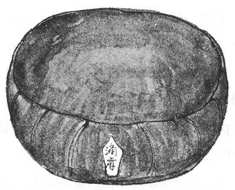

# Preface by Mike Luetchford

Near the end of the 1990’s – around 1997 or 1998 – Sensei emailed me the manuscript of a book that he had been writing, which he had titled “Handbook of Authentic Buddhism”. He said that he wanted to set down his complete thoughts on Buddhism as a handbook that others could make use of, and he asked me to edit and publish it, as I had done with all of his other writings. At the time I was spending a lot of time trying to edit his translation of Nagarjuna’s Mulamadhyama Kakarika (MMK), a manuscript I had been working on with him since 1992, and so I put the file in a folder on my computer’s hard disk as a future project. And that is where it stayed for the next 20 years, until two months ago, when I rediscovered it when looking for material to publish on the website we are creating for all Sensei’s work at shobogenzo.net. I was deeply involved in his translation of the MMK for some 8 years, and finding it almost impossible to understand his way of translating the work. I wanted to attend a summer course in Sanskrit at Harvard University in the summer of 1998 to deepen my knowledge of the language. This was to change the course of my life, and of my relationship with Sensei. After the course at Harvard, I decided to return to the UK, in part to give myself space to complete what was to become my own translation of the MMK. I subsequently started another project that had been waiting in the wings for some 15 years – a translation of the 300 Chinese koan stories that Dogen had collected. The many events of the next decade, and my worsening relationship with my teacher, meant that I forgot of the existence of the handbook that Sensei had wanted me to publish for him. But it’s never too late, and here at last is an edited version that you may find interesting and valuable. I decided to only edit it where the meaning was not clear, or where the expressions he used could be misleading. Although his English improved over the years, he writing was always idiosyncratic, and he would sometimes invent his own English terms for a concept.

The handbook reflects the character of the man. He had read widely on Western history and philosophy, including the writings of all the great philosophers. He had studied the history of western civilization, and particularly Greek civilization, in great detail. He was also keenly interested in world affairs, and could always be relied upon to give you a clear and opinionated view of all aspects of modern Japanese society and global politics, as anyone who lived with him in the Ida Zazen Dojo in Tokyo in the 1990s will confirm. Some of the ideas he presents in this handbook will seem outdated 20 years later. And his hopes for the future of the world may appear to be just a dream. He would sometimes say that he felt like a modern-day Don Quixote, but felt compelled to let the world know of his ideas of the development of world civilization, no matter how crazy people thought he was. His views on relationships and sex were those of a man born in pre-war Japan – he was a man of his time – and difficult to accept in these liberal times. Although he was open-minded with his foreign students, his attitude to his Japanese students was conventional. He would accept criticism from his foreign students – even welcoming it – but not from his Japanese students, who treated him as Japanese people traditionally treat their “sensei” – with great reverence, deference and respect. This was one of the reasons why he loved his discussions with foreign students.

Read the book with an open mind. Many of you will be familiar with his teachings on Dogen and the Shobogenzo. Although his vision of the world in later chapters may seem far from reality, there is a thread of truth running through many of the things he advocates. His idea of a global power that can bring peace, order and stability to the world might seem far-fetched, but he paints a picture of the world with a large brush, in big bold strokes. And he was a proud man. Forty or so years down the line, I realise that I believe in his vision, not literally, and not perhaps in the form that he imagined. But I think that history does have a direction. Life has a direction. Every moment has a direction. If only I knew where it is taking me!

If you find anything in the book that you think needs changing or clarifying, would you please let me know at my usual gmail address. Thanks.

**Mike Luetchford**

# 1. Introduction

What is Authentic Buddhism? Authentic Buddhism is Buddhism which was established by Gautama Buddha, and has been transmitted through Theravada Buddhism, Mahayana Buddhism, Master Nagarjuna, Master Bodhidharma, Chinese Buddhism, Master Dogen, and to us. It is said that it is very difficult for us to explain Buddhism with words. And it may be true. But if we do not to explain something with words, it may be impossible for anyone to explain it to others. Therefore, I would like to challenge such a difficult trial, that is, to explain Authentic Buddhism in words. 

# 2. Becoming a Buddhist

Recently it is not so prevalent, but at the beginning of becoming Buddhists we have a ceremony to receive Buddhist precepts from our Buddhist teacher. By receiving the precepts we become Buddhists for the first time, and then we begin our Buddhist life. To make my description rather concrete, I would like to start my explanations from such concrete fact.

In the ceremony, the teacher gives sixteen precepts to his/her student. The precepts are divided into three groups as follows.

## 1\. The three devotions

1. Devotion to Buddha
2. Devotion to Dharma
3. Devotion to Sangha

## 2\. The three summarized precepts

1. The observance of rules
2. The observation of Dharma
3. The salvation of all living beings

## 3\. The ten fundamental precepts

1. Don’t destroy life
2. Don’t steal
3. Don’t desire to excess
4. Don’t lie
5. Don’t live by selling liquor
6. Don’t discuss failures of Buddhist Priests/nuns and laypersons
7. Don’t praise yourself and don’t blame others
8. Don’t be sparing of Buddhist teachings or other things
9. Don’t become angry
10. Don’t abuse the three supreme values

# 3. Object of Worship

The reason why I quoted the Buddhist precepts is that I think it is very nice way to know the object of religions for getting the fundamental idea of each religion. 

And in the case of Buddhism we can find the first group of the precepts, that is, the three devotions. And I think that by researching the meanings of the three devotions we can get the outline of Buddhism. The three devotions are devotion to Buddha, Devotion to Dharma, and devotion to Sangha.

## 1\. Buddha

First of all Buddha means Gautama Buddha, who was born in ancient India in 383 B.C. He was a son of a king in a small kingdom of north-east India, who had much interest in philosophical problem, and after his sincere efforts to pursue the truth, found some kind of ultimate philosophy in the world. 

But the word Buddha has the second meaning. After Gautama Buddha, there were many people who believed in his teachings, practiced their Buddhist efforts, arrived at the ultimate state, and lived their peaceful lives. And those people are also called Buddhas. 

And further the word Buddha has another meaning. A person who behaves with Buddhist behaviour here and now is also called Buddha. Because Buddha is some kind of universal state, and so everyone can be a Buddha. What is the behaviour of Buddha? To behave as Buddha means to behave yourself following the rule of the Universe, and to behave yourself following the rule of the Universe means to behave morally. Therefore, a person who behaves morally can be called Buddha.

And in the ultimate phase Buddha is all things and phenomena in this world. Because Master Dogen insisted that all beings are Buddha-nature, we can think that this world is full of Buddha-nature, and if it is so, we can think that this world is totally some kind of religious entity, which is called Buddha. 

## 2\. Dharma

The next object of Buddhist worship is Dharma. What is the meaning of Dharma? Dharma means first of all Gautama Buddha’s teaching. Gautama Buddha left us his philosophy which can be thought as the ultimate philosophy of this world for Buddhists at least. His teachings include belief in reality, the rule of cause and effect, instantaneousness of this world, oneness of spirit and matter, and so forth.

And according to the Buddhist theory of oneness between spirit and matter, even Gautama Buddha’s teachings have to have some kind of background which has substantial entity, that is this world. In Buddhism, we think that this world is also Gautama Buddha’s teachings themselves. Gautama Buddha taught us a fundamental principle which governs the whole Universe, and so the whole Universe or the physical world is the other side of Gautama Buddha’s teachings, and we also call it Dharma. 

And in the third phase we can find a synthesis between Gautama Buddha’s teachings and the physical world, that is a dialectic synthesis of the two, human conduct. Thinking realistically, Gautama Buddha’s teachings can only be realized by human behaviour on the earth. Without human behaviour, there cannot be any Gautama Buddha’s teachings in the Universe really, and if there is no human behaviour the Universe can never have any real meaning. We can say that just human behaviour make both Gautama Buddha’s teachings and this world exist really. In this meaning, human behaviour is also called Dharma. 

Then Dharma includes Gautama Buddha’s teachings, the physical world, and, as the synthesis of the two, human behaviour. In this phase Dharma is something totally inclusive. It is something ineffable, it is something complicated, and Indian people in ancient times called it Dharma. When I want to express it in English, I prefer to use the word “reality”, because I think the word reality is the nearest one which represents Dharma.

## 3\. Sangha

Sangha is a community in which people pursue Gautama Buddha’s teachings devotedly. In ancient India Gautama Buddha himself had such a community, and many Buddhist people gathered around him to listen to his preaching, to practice Zazen, to realize the Buddhist truth, and to save others. The Sangha includes Buddhist monks, Buddhist nuns, Buddhist laymen, and Buddhist laywomen. And in Sangha there was no discrimination because of classes. It is said that in India there was very severe discrimination between different classes in the ancient time, but if someone entered a Buddhist Sangha he or she could completely avoid the restriction of classes.

Such communities were established at many places in the country, and then they spread outside the country. One stream flowed to Gandhara and along the Silk Road and arrived in China in the first century. And it went further to Korea and Japan. Another stream went to Ceylon, Indonesian islands, Burma, Thailand, and so forth. There was another stream which went to Tibet and China. In those countries many Buddhist communities, which are called Sangha, were established, and many of them have been maintained until today. Those also belong to Sangha.

In Buddhism, we have an idea that everyone who practices Zazen establishes his or her own Buddhist land at the place where he or she is practicing Zazen. Formally speaking it is necessary for a Buddhist Sangha to have at least five members in order to be a Buddhist Sangha. It is just a figurative expression, but we can think that everyone who practices Zazen establishes his or her own Buddhist Sangha at the place where he or she is practicing Zazen. In this meaning, Buddhist Sanghas can exist everywhere when someone practices Zazen at any time. 

According to such idea, Buddhist Sanghas can exists everywhere in the world. And if we think that our human destiny is that all human beings will realize reality as Buddhism says, all human societies can be Buddhist Sanghas. 

## 4\. Common factor between Buddha, Dharma, and Sangha

Etymologically speaking, the meaning of the word “Buddha” is “a person who has awakened”, and what becomes awakened is usually called Dharma. And Sangha means the organization of people who pursue Dharma. The three kinds of jewels in Buddhism, that is, Buddha, Dharma, and Sangha are all related with Dharma, and, as I explained above, Dharma means reality. And so we can think that the three kinds of jewels, Buddha, Dharma, and Sangha are all related with reality. 

# 4. What is Reality?

When we think about the problem, there is some serious difficulty in Buddhism. Because it is usually said that reality can never be described with words. 

For example, in Indian Buddhism we find the very important concept “Sunyata” which is translated into “nothingness”, “voidness”, or “emptiness” in English. The concept does not mean denial of reality at all, even though some Buddhist scholars and monks/nuns have such interpretation, but Sunyata means denial of intellectual thoughts and sense perception. By relying upon such negative expression Buddhism wants to represent reality which cannot be described with words. 

A very famous and important Buddhist book in India called “Mulamadyamakakarika” by Nagarjuna is full of such negative expression, and relying upon such method Nagarjuna wanted to describe reality which is usually impossible to be expressed with words.

In China there is an expression “Gongo-Do-Dan” (in Japanese pronunciation) which represents the essence of Buddhism. Gongo means speech, Do means expression, and Dan means being cut completely. Therefore Gongo-Do-Dan means that verbal expression is completely cut, and this expression suggests the situation of reality.

Chinese Buddhist Master Nangaku Ejo, when he was asked by his Master Daikan Eno what the situation of reality is, he answered; “If it is described with words, the expression does not hit the target”.

In Japan Master Dogen described reality as Fukaku Fuchi. Fu means denial, Kaku means perception, and Chi means recognition. Therefore, Fukaku Fuchi means “beyond perception and beyond recognition”, and this is also a description of reality.

Thinking about the situations above we have to wonder whether we can describe reality with words or not. But if we give up to describe reality with words, it will become impossible for us to express Buddhism with words. And some Buddhist monks and nuns proudly say that, no, it is impossible for us to express the essence of Buddhism with words, and so they think that philosophical explanations of Buddhism are useless to represent reality. But if it is true, we can never accept the simile of the finger which points at the moon.

# 5. The Four Noble Truths in Early Buddhism

Even in the time of Gautama Buddha this problem existed, and so Gautama Buddha himself suffered from the problem so much. We can guess that the most important problem which Gautama Buddha struggled with was how to explain reality with words to all people in the world. And after his hard and sincere efforts he arrived at his excellent method, that is, the theory of four philosophies. 

In Buddhism we can find very famous expression in Sanskrit “catvary aryasatyani”. Catvary means four, arya means sacred and satyani means truths or philosophies, and so “catvary aryasatyani” is usually translated into “four sacred truths”. And the catvary aryasatyani are constructed of “duhkha satya”, “samudaya satya”, “nirodha satya”, and “marga satya”.

There is a very old traditional interpretation of the theory of four philosophies, as follows.

Duhkha means suffering, and duhkha satya means truth of suffering. What is the meaning of the truth of suffering? They say that the truth of suffering suggests the theory that all the world is just full of suffering.

Samudaya means aggregate, and they say that samudaya satya suggests the idea that all sufferings come from desire.

Nirodha means denial, and nirodha satya suggests to deny our desire.

Marga means path, and so marga satya suggests the path to arrive at the truth, and it means the ultimate state of Buddhist life.

In short the theory of four philosophies indicates the theory that this world is full of suffering and the suffering comes from our desire, and if we erase our desire, we can meet the truth.

When I read this theory in a Buddhist book in my youth, I could not help feeling some strange impression. It was impossible for me to think that this world is only full of suffering. Because, even though we have much suffering in our daily life, we sometimes feel happy situations. It was rather difficult for me to think that the world is only full of suffering. And at the same time, I could not affirm that all suffering comes from our human desire. This insistence sounds a little too dogmatic, and I felt some kind of asceticism which usual religions are prone to have. And I doubt whether we can erase our human desire. I thought that our human desire is manifestation of our life, and so to erase our desire is just the same as to die. I could not believe in such strange insistences, and I wanted to get a different interpretation other than the traditional one.

# 6. The Four Philosophies in Shobogenzo

And later when I read Master Dogen’s books, especially Shobogenzo, I had a new idea about the theory of four philosophies. 

In Shobogenzo we can find a chapter entitled “Genjo Koan” or the Realized Law of the Universe. And in the first paragraph of the chapter we find the following sentences.

>“When all dharmas are seen as Buddhist Dharma, then there are delusion and realization, there is practice, there is life and there is death, there are buddhas and there are ordinary beings. When all myriad dharmas are not of the self, there is no delusion and no enlightenment, no buddhas and no ordinary beings, no life and no death. The Buddhist Way is originally transcendent over abundance and scarcity, and so there is life and death, there are delusion and realization, there are beings and buddhas. Though all this may be true, flowers fall even if we love them, and weeds grow even if we hate them”. 

Reading these sentences, I have to feel a little strange. Because in the first sentence Master Dogen said “there are delusion and realization, there is practice, there is life and there is death, there are buddhas and there are ordinary beings”. But just after the sentence he said also “there is no delusion and no enlightenment, no buddhas and no ordinary beings, no life and no death”. In short, in the first sentence he affirmed existence of delusion and realization, practice, life and death, and buddhas and ordinary beings. But just in the second sentence he denied the existence of delusion and enlightenment, buddhas and ordinary beings, and life and death. 

## 1\. Philosophy of subjectivism

Reading those contradictory sentences, I feel usually strange, but when we think about the meaning of the two sentences, we can notice that the difference of his conclusions in the two sentences might have come from the difference between the two conditional clauses in the two sentences. In the first sentence the condition is “When all dharmas are seen as Buddhist Dharma”, and the condition in the second sentence is “When all the myriad dharmas are not of the self”. And those two conditions introduced completely different conclusions. So it is necessary for us to think about the meaning of those two conditions.

“Buddhist Dharma” can be interpreted as Buddhist viewpoint or Buddhist criteria, and so “When all dharmas are seen as Buddhist Dharma”, can be understood to mean when all things and phenomena are considered according to Buddhist criteria, in other words, when all things and phenomena are considered on the basis of theoretical Buddhist criteria. The first sentence suggests that when we think about all things and phenomena on the basis of Buddhist teachings which is based on the Buddhist explanatory thoughts, we can recognize the existence of delusion and realization, practice, life and death, buddhas and ordinary beings. In the first sentence Master Dogen recognizes religious value in rather subjective criteria which is called Buddhist Dharma.

## 2\. Philosophy of objectivism

But in the second sentence he said “When all the myriad dharmas are not of the self”, and we can guess that Master Dogen explained a completely different viewpoint than that of the first sentence. What is the meaning of “are not of the self?” To be not of the self may be denial of our subjective attitude, therefore it suggests objective attitude. Then we can interpret that the first sentence is an expression of the subjective viewpoint and the second sentence is an expression of the objective viewpoint.

So even though the two sentences are very simple and short, we can suppose that Master Dogen intended to represent the two fundamental philosophical viewpoints, that is, subjectivism and objectivism. Thinking like this we can understand his intention to compare the two completely contradictory insistences in the same paragraph. 

## 3\. Existence of action

However, he progressed further. In the third sentence, he said “Buddhist Way is originally transcendent over abundance and scarcity”, and he insisted a transcendental character of Buddhism beyond abundance and scarcity. In this sentence, we find the word “Buddhist Way”, and we should think about the meaning of the word in the original text. The original Japanese word in the text is “Butsu Do, or Buddhist Way”, and the character “Do” is the same character as “Tao” in Chinese. The character suggests rather inclusive concept, which includes not only a mental or philosophical side but also a substantial or practical side.

And Master Dogen insisted that the practical Buddhism transcends both abundance and scarcity. What is the meaning of abundance and scarcity. I think that abundance and scarcity suggests first of all a relative comparison, and so he insisted that Buddhism does not belong to the area of comparison. Is there anything which does not belong to the area of relative comparison? Thinking about such a problem, I have to remember that our human thinking ability belongs to the area of relative comparison and our human sense perception also belong to the area of relative comparison. It is necessary for us to think that there may exist an area which does not belong to the area of human intellectual thinking and human sense perception.

Is there any area which does not belong to either intellectual thoughts nor sense perception? Being governed by our traditional mental attitude it is rather difficult to find the area which does not belong to intellectual thoughts or sense perception. But when we think about our actual situations in our daily life we can find that we are living neither in the area of intellectual thinking nor in the area of sense perception, but we are just living in the area of real life.

It is very strange that even though we are always living in real life, we usually do not recognize such a simple fact. Because of our human excellent ability to think and perceive, some people are prone to think that they are living in the world of thinking, and some people are prone to think that they are living in the world of perception. And I think that Gautama Buddha found the simple fact that we are living just in the real world, and he recognized that tremendously many or almost all people do not notice that they are just living in the world of reality. The word “Buddha” means a man or woman who has awaked to reality, and we can think that what Gautama Buddha found in his enlightenment might be reality itself.

Then what is reality? According to the traditional idea of Buddhism reality is always something which cannot be described with words. Of course, it is true. But if it is true, we have to accept that it is completely impossible for us to discuss anything in Buddhism. And if we accept such principle we cannot think about anything in Buddhism at all, and such situation suggests the impossibility of studying Buddhism. Shall we give up to study Buddhism? If it is so, the problem is too serious.

Master Dogen, however, explained Buddhism in Shobogenzo with words. If we follow his method to explain Buddhism with words, we may find the way to explain Buddhism with words even though it is not a perfect explanation of reality.

Conclusively speaking I think that his method to find reality relies upon action. In our daily life after getting up in the morning we usually begin to think, and usually such thinking continues almost all day long. Of course, we have another time in which we accept external stimuli. For example, a time when we are eating meals or watching television. At that time, we usually stop thinking, but at the same time our mind is occupied by sense perception. We can think that our daily life is occupied sometimes by intellectual thinking and sometimes by sense perception. But actually we have another time which is different from either intellectual thinking or sense perception. Is there any such strange time in our daily life actually? Yes, that is the time when we are acting. 

When we are acting, our intellectual thinking retreats from our mind, and our sense perception also retreats in our consciousness. In our daily life it is necessary for us to think that action is some different state from our intellectual thinking or sense perception. We can see that action is different area from intellectual thinking and sense perception. But it is very rare for people to notice this fact. Gautama Buddha noticed this fact and he established his philosophy relying upon this fact. In short he found a new area which people usually do not recognize. He preached his philosophical thoughts relying upon human action.

## 4\. Philosophy of action

What is the philosophy of action? It is different from logical series of intellectual thoughts or collected knowledge of facts which are perceived by the senses. It is a kind of description in experience of action. 

First of all action occurs at the mutual contact between a person who acts and the circumstances which encompass the actor. Action usually includes the two factors, that is, one is the actor and the other is the circumstances. But at the same time the two factors can never be separate. When I want to explain action, I usually use a simile of a match. If we hold a match in our fingers even for thousands of millions of years, we will never get fire, and if we keep the matchbox even for thousands of millions of years, we can never get fire. But when we strike the match on the matchbox, we can get fire at once. I use the match as a simile for the actor, a matchbox as a simile for circumstances, and fire as an action. Action has such a structure, and when just the actor exists, action can never occur and when just the circumstances exist, action can never occur. At the same time action is completely different from the actor and action is completely different from the circumstances. This fact is very simple and so it was very strange that human beings did not notice the fact for limitlessly many years until Gautama Buddha noticed. And after he noticed it, many Buddhists also realized the fact, but comparing the total number of Buddhists with the number of human beings in the history of the world, the number of Buddhists are not so many. And even among Buddhists, those who recognized the fact are rather rare. But Gautama Buddha found this important fact more than two thousand and five hundred years ago, and his teachings which rely on this fact have continued until today.

I interpret that the word “Buddhist Way” in the third sentence of the first paragraph in Shobogenzo Genjo Koan suggests such meaning of Buddhism which is based on the action. He recognized the existence of life and death, delusion and realization, and ordinary beings and buddhas in that area, but the existence which he described in the third sentence may be completely different from the existence which was described in the first and second sentences. Because the first sentence was thought on the basis of intellectual thinking which relies upon Buddhist teachings, and the second sentence was thought on the basis of sense perception. But the third sentence was written relying upon real Buddhism which was established by Gautama Buddha and which is based on the philosophy of action. 

## 5\. Reality itself

But Master Dogen’s idea steps forward further. He may have thought that we can have two fundamental philosophies in our intelligent area, but in Buddhism we can find a completely different philosophy, that is, the philosophy of action. Therefore we can have three philosophies in Buddhism; they are subjectivism or idealism, objectivism or materialism, and philosophy of action or real Buddhism. But those three philosophies are just philosophies and they are not reality itself. This thought is also very important in Buddhism, and so to express this, Master Dogen said in the fourth sentence that “Though all this may be true, flowers fall even if we love them, and weeds grow even if we hate them”.

In this last sentence Master Dogen wanted to describe the scenery of this world which is completely different from the three philosophies. This attitude is also very important in Buddhism. Because of our absolute reverence for our thinking ability, we are prone to place too much value on the two fundamental intellectual philosophies and sometimes forget the existence of the real world itself. And even though in Buddhism we have the philosophy of action, it is very important that even the philosophy of action can never replace just reality itself. Gautama Buddha insisted the importance of the experience that we, human beings, are just living in reality itself. 

Master Dogen described this world with his short sentences, “Though all this may be true, flowers fall even if we love them, and weeds grow even if we hate them”. Of course, it is true that it is impossible for us to express the real world with words, but I guess that it was impossible for Master Dogen to stop saying something about reality, therefore he expressed his short rather poetical sentence to suggest reality.

Reading the first paragraph of Shobogenzo Genjo Koan we can find such characteristic structure of Master Dogen’s thoughts, and even after my Buddhist study for more than fifty years, I cannot doubt that his peculiar thinking method can be identified with the catvary aryasatyani in ancient Buddhism. I would like to think about the meaning and value of this thinking structure in the next chapter.

# 7. Wisdom of Four Philosophies

Even though the theory of four philosophies seems to be rather complicated and not to have any clear meaning, I think it has very valuable meaning and function in human thoughts and history. To make the situation clear I would like to state some fundamental points as follows.

1\.  The four philosophies show Subjectivism or Idealistic philosophy as the first philosophy. And this is related with the fact that all human beings think about their philosophical problems, of course, with their brain, in other words with their intellect. The first philosophy which they think first is usually subjective or idealistic. We like dreams, hopes, intentions, plans and so forth which encourage us at the beginning of our life.

2\. Dreams, hopes, intentions and so forth, however, can never be reality itself. In our actual life dreams and so forth are usually broken by reality. And this is a very important experience for human beings in their life. In short, we can find that subjective ideas in our mind are different from reality. Then we can find another area which is different from our thoughts. That is the area of concrete things. Here we begin to research the world of fact. This research can be called scientific and we can get knowledge of concrete facts.

3\. In general, science reveres concrete facts so much. And concrete facts are usually the result that comes from our sense perception. We can think that scientific research is usually based on our sense perception, and the object of such sense perception is usually called matter. From this situation, scientific people usually revere matter, and such attitude sometimes creates a materialistic philosophy. It is very natural that materialistic thoughts have become very powerful in the modern ages when scientific knowledge has developed so enormously.

4\. We always have many dreams in our first steps and enjoy enormously many dreams in our daily life, and if we continue to stay in subjective consideration, we cannot recognize that this subjective consideration is different from our daily life. But sometimes the physical, substantial, or economic situation force us to wake up from these comfortable dreams. 

We should think that those two fundamental attitudes in our daily life are both very important. But in our human life the historical situations were a little different. Idealistic people have been insisting that their idealistic philosophies are the truth for thousands of years at least, and materialistic people also have been claiming that their materialistic philosophies are the truth for thousands of years. But Gautama Buddha indicated such human stupidity more than two thousand years ago.

He said that we should not select only one philosophy from the two. He taught us that the two philosophies are both important. They are two faces of reality. We should not prefer one over the other.

5\. This insistence says that it may be very stupid for us to prefer only one philosophy from the two, subjectivism and objectivism, or idealism and materialism. But looking at our long human history, however, we have to admit there have been very sad situations in which many serious, brutal conflicts between two powers have occurred because of the confrontation between the two fundamental attitudes of how human beings think, in short, the confrontation between idealistic philosophies and materialistic philosophies. 

6\. At the same time we find here a very serious problem, that is, whether it is possible to accept these two fundamental philosophies both together. Thinking about this problem we should divide the field of discussion. In the area of philosophical thinking we can accept the two fundamental philosophies as two kinds of philosophies. But in the area of belief or worldview it is impossible for us to accept the two philosophical beliefs or worldviews. Because in the area of belief, if we believe in idealistic philosophy, we can never accept materialistic philosophy. And if we believe in materialistic philosophy, we can never believe in idealistic philosophy. Because the two fundamental viewpoints are based on completely different beliefs. Idealism is based on the belief that this world is a product of the human mind, but materialism is based on the belief that this world is constructed of physical matter. Therefore if we affirm the former, the latter must be completely wrong, and if we accept the latter, the former is completely wrong. If we accept this conclusion, we have to doubt the value and meaning of the theory of four philosophies. And we should not easily pass over this barrier.

7\. Thinking about this problem, if we stay only in our intellectual area, it will be completely impossible to solve the problem. In our intellectual area we should not violate Aristotelian logic. And so if we like to find a solution to the problem, we have to find an area which is different from intellectual thinking. Is there any such human area which is different from the area of intellectual thinking? Regarding this problem I would like to come back to our own day-to-day life. When we think about our own life, we can find two fundamental human mental abilities, that is, thinking ability with the intellect and perceiving ability with the senses. And we can think that idealistic philosophy may be based on our human thinking ability and materialistic philosophy may be based on our human sense perception. But at the same time, we can find another human function in our daily life, that is action. 

8\. In our daily life we can find three kinds of time, one is a time when we think and another is a time when we perceive but at the same time it is impossible for us to deny the existence of a time when act. Comparing action with intellectual thinking and sense perception, we can easily find the difference between action and intellectual thinking and the difference between action and sense perception. For example if we concentrate on acting, it is very difficult to think, and if we think about something, it is very difficult to concentrate on acting. We can easily notice that action and intellectual thinking are different from each other. At the same time if we concentrate on acting, it is also very difficult to be clearly aware of external stimuli. It seems that action and sense perception are also different from each other. And I think this fact is rather important when we think about Buddhist theory. Because in my opinion the most important fact that Gautama Buddha found is just the existence of action in our day-to-day life. 

9\. The third philosophy which is called nirodha-satya in Sanskrit means philosophy of denial. And what kind of denial does it mean? I interpret that denial may refer to the denial of both intellectual thinking and sense perception. I think that after his long practical efforts Gautama Buddha found the existence of action which is completely different from intellectual thinking and sense perception, and this discovery may be the most important point in Buddhist theory. We can think that the third philosophy which Gautama Buddha suggested may be the philosophy of action, and we can presume that Gautama Buddha’s philosophy has developed relying upon the philosophy of action.

10\. In Buddhism we can find the belief in oneness between body and mind, or oneness between subject and object, or oneness between spirit and matter. And when we think about the situation in which action takes place, we can understand the meaning of those ideas clearly. Action is always contact between ourselves and the circumstances, a combination of mind and matter, or a meeting between human beings and their environment. With only ourselves, in other words without circumstances, action can never occur and with only our thoughts, action cannot be realized. Action cannot take place relying only on mental factors. But at the same time without ourselves, action cannot exist even if the circumstances exist. We can also say that even if the circumstances are present, if we are not present, it is impossible for our action to appear in this world. Looking at the situation we can notice that acting is completely different from mind or environment. For thousands of years it has been very rare for human beings to discuss the problem of action in their philosophies other than in Buddhism. But I think that human beings have begun to approach the philosophy of action.

11\. Action is different from intellectual thinking and at the same time it is different from sense perception. In the case of intellectual thinking we can rely upon our logical process of thinking and construct idealistic philosophy. And in the case of sense perception we can collect miscellaneous facts and establish materialistic philosophy. But in the case of action we have to notice that action transcends actually both intellectual thinking and sense perception. When we want to describe action, sometimes we have to rely upon, not positive, but negative expressions. The fact that one of the most important Buddhist scriptures “Mulamadyamakakarika” by Nagarjuna is full of negative descriptions and “Shobogenzo” by Master Dogen has similar characteristics, comes from the situation that it is difficult to describe action with words positively, and so if we want to express the content of action, we sometimes have to rely upon negative expressions.

12\. But at the same time it is necessary for us to describe action positively. Because without positive expressions it is rather difficult for us to grasp what action is. And for that purpose, we sometimes use dialectical method to describe action. And that is the reason why Buddhist scriptures seem to contain so many contradictory insistences. 

13\. At the same time action is always done at the moment of the present. Because once the present moment has passed it never appears again. Therefore, we cannot live in the past at all. And the future has not come yet and so we can never actually live in the future. We have to recognize that we can never live in the past and we can never live in the future. We can say that the present moment is the only real time in which action exists actually. 

14\. In Buddhist philosophy we can find three kinds of philosophies which are called Idealism, Materialism, and the philosophy of action. But we should clearly notice that philosophies can never be reality. Even though those three kinds of philosophies help us to describe images of reality, those images can never become reality itself. We should think that reality is completely different from the images of reality that the three kinds of philosophies describe. Therefore Master Nangaku Ejo said, “If I put it into words, they will not hit the target”.

15\. Then some people think that reality might belong to the area of sense perception. But this idea is also wrong in Buddhism. Because in Buddhism we do not think that what is perceived is reality. What is perceived is just what is perceived. People who are called Materialists usually make this mistake, and they think that what they perceive is just reality. Therefore, they sometimes call themselves Realists. But this idea might be wrong, and their idea comes from their own overestimation of themselves. Generally speaking, what is perceived is always individual and limited inside what is perceived, but reality has to be totally inclusive like the Universe. We should never identify what we perceive with reality.

16\. Reality exists here and now, and it includes ourselves too. When we experience that we exist in reality, we can experience reality throughout our body and mind, but if we are out of reality because of intellectual thinking or sense perception, we cannot experience reality. If we want to know what reality is, we have to enter reality itself. And because of this situation many Buddhist practitioners who want to grasp reality have practiced Zazen. Reality exists in our action, and so by relying on action, or by relying on the practice of Zazen, they could enter reality at once. We can say that many Buddhists have been making their efforts to try to experience reality which is impossible to express with words for thousands of years relying upon practicing Zazen. 

17\. Even though it is impossible for us to express reality with words, we Buddhists have made efforts for such a long time to express it with some method. And one example of a method to do this is the Chinese Buddhist stories which are called Koans. The Koans are stories which approach reality by describing Buddhist discussions between Buddhist teachers or Buddhist monks/nuns. They usually begin with an abstract question about Buddhism and the teacher, who is asked, answers by indicating concrete facts. And so the Buddhist monk/nun asks more realistic questions about the problem between the abstract question and the concrete facts, and then the teacher suggests reality by showing their own behaviour or poetical expression or silence or a shout “Katsu”, and so forth. And sometimes reality is described with poetical expression like poems. The reason why Buddhist teachers made so many poems comes from such situations. But the most direct and the most effective method to experience reality is the traditional Buddhist practice which is called Zazen. By practicing Zazen we can directly enter into reality itself. Therefore, the practice of Zazen was revered so much in Buddhism. By practicing Zazen we can become reality itself directly.

# 8. Physical Side of Buddhism

Buddhism insists on oneness between spirit and matter or body and mind. All Buddhist theories should have their own substantial basis inevitably. And so the theory of four philosophies should necessarily be explained on the basis of physical side too. I think that the efforts to explain the Buddhist theory on the physical side are not so popular in the past. But in the modern age when scientific knowledge is so enormously important we should also be diligent to explain Buddhist principles from the viewpoint of physical substance. 

In the fourth or fifth century B.C., when Buddhism was established by Gautama Buddha for the first time, there was not the enormous and excellent scientific knowledge that we have in the modern ages, of course. We cannot find scientific explanation of Buddhist theory in ancient times, but that facts do not mean that we should not interpret Buddhist principles on the basis of modern science. And when we explain Buddhism on the basis of scientific knowledge, the explanations may at first be some kind of hypothesis. Because, when some theory is established, before it is verified by scientific research, the theory is only a belief, dogma or hypothesis. 

If I want to insist that some theory can explain Buddhist theory on the basis of physiology or psychology, I should clarify with scientific knowledge why I insist on such kind of hypothesis on the basis of psychology or physiology. But, unfortunately, I am neither a psychologist nor physiologist, and so I have to expect that some physiologists and some psychologists will verify whether my hypothesis is true in future. The theory which I describe below is just a hypothesis so far. We should recognize such situations clearly, and so I never insist that my hypothesis is the truth. But since I formed the hypothesis, more than forty years have passed, and during the time I haven’t found any situation in which I have to deny my hypothesis at all. I have very clear expectation that many physiologists and psychologists will affirm in the future that my hypothesis may be correct.

## 1\. Karl Menninger’s idea

My hypothesis has come from reading books by the American psychologist called Karl Menninger entitled “The human mind”, “Man against himself”, and “Love against hate”. I read those books in the Japanese translation first and later I read them in English. In “Man against himself” the author explained the psychology of suicide. He explains that suicide is not done because of the weak personality of the victim, but it is done because of the aggressive attitude of himself or herself. According to the author’s insistence, suicide usually shows a very aggressive tendency; first their aggressive attack goes against others outside. But in the actual situations their aggression is not always successful. And if their aggression is not successful in attacking others outside, their aggressive attack is sometimes directed against themselves, and they actually kill themselves. And such facts are called suicide. Therefore suicide can be interpreted actually to mean “to kill oneself”. 

And then I read another of his books entitled “Love against hate”. In the book, he insists that “hate should be balanced by love” and “love should be balanced by hate”. And this idea struck me in my youth.

In Buddhism we have the concept of a middle way. Buddhism insists that the extremes are usually wrong and the truth usually exists in the middle way. And at the same time Buddhism insists on the co-existence of love and hate. The reason why Buddhism does not always affirm love comes from this theory. Buddhism does not value love solely, but it always thinks about hate which exists inevitably behind love. Thinking about this Buddhist theory, it was impossible for me to doubt the author’s idea. I guessed that even though we value love so much and dislike hate so much, in real situations love and hate may be two sides of one thing, and Gautama Buddha knew this fact so well that he recommended us to be careful in love.

## 2\. Balance of autonomic nerves

But at the same time if I believe in the Buddhist theory of oneness between body and mind, it necessary for me to find the physical basis for love and hate in the human body. At that time my physiological knowledge about the human body was very poor, and so I read some primary texts on physiology and looked for the physiological basis of co-existence between love and hate. And in reading a physiological book I noticed the existence of the autonomic nervous system in the human body. 

In my class in junior high school I learned that we human beings have a nervous system called the autonomic nervous system in our body. And after I began to study Buddhism I had some vague expectation that the relation between love and hate has some identity with the relation between the parasympathetic nerves and sympathetic nerves.

Later, the more Buddhism and physiology I studied, the more my belief in my hypothesis increased, and in the end it has become my strong belief. At that time my colleague in the translation of “Shobogenzo”, a young Englishman called Mike Cross, presented me with a physiological book in English entitled “Brain, Mind, and Behavior” by Floyd E. Bloom, Arlyne Lazerson, and Laura Hofstadter. 

The book describes the relationship between our human mind and body physiologically. The book is not specialized, but it is rather educational. The book explains our human behaviour from a physiological viewpoint, and it was very useful for me to read the book to get an outline of the relationship between the human body and mind. 

The book looks for the centre of the body and mind in our nervous system. The book divides the nervous system into two parts, that is, “Central Nervous System” and “Peripheral Nervous System”. The main parts of the central nervous system are the brain and the spinal cord, and the main parts of the peripheral nervous system are “Autonomic Nervous System”. According to recent scientific research the authors divided the peripheral nervous system into two further parts, that is, the autonomic nervous system and the diffuse enteric nervous system, but, as far as we are concerned, I think that this specified division is not so important, and so I prefer to include the diffuse enteric nervous system together with the autonomic nervous system.

## 3\. Sympathetic nerves and parasympathetic nerves

The autonomic nervous system is further divided into two parts, that is, “Sympathetic Nervous System” and “Parasympathetic Nervous System”. And it is rather interesting that the two kinds of nervous system work in completely opposite directions. 

I think that it is rather helpful to show the opposite functions of the two kinds of nervous systems in some contrasting table. And fortunately, the book “Brain, Mind, and Behavior” shows a diagram which represents the functions of the sympathetic nervous system and parasympathetic nervous system. Relying upon their diagram I would like to show a list of the mutual functions between the two nervous systems as follows. 

**List of The Functions Between Sympathetic Nervous System and Parasympathetic Nervous System**

Looking at the list above, we can find that the parasympathetic nervous system and sympathetic nervous system have completely opposite functions and work against each other in each organ.

Then I began to think about the relationship between the autonomic nervous system and love and hate. Because it seems to me that the two kinds of nervous system, the sympathetic nervous system and parasympathetic nervous system, show parallels with hate and love.

## 4\. My hypothesis on the relationship between mind and body

I am neither a physiologist nor a psychologist, and so the following insistences are only my hypothesis, and haven’t been verified yet. Since I began to have the hypothesis more than forty years ago, I have been testing and researching the validity of my hypothesis in my Buddhist study and in my day-to-day life frequently without bias, but I haven’t met any situation in which I had to give up my hypothesis. Even though it is only my hypothesis now, I am convinced that physiologists and many psychologists will verify in future that my hypothesis is right.

My hypothesis on the relationship between human mental activity and the autonomic nervous system is as follows. (In the following explanations I would like to use the abbreviations ANS for the autonomic nervous system, SNS for the sympathetic nervous system, and PNS for the parasympathetic nervous system.)

1. Human mental activity, especially emotions like hate and love are closely related with the state of the ANS.

2. When we think something, our SNS tends to be more excited than usual.

3. When we perceive some external stimulus, our PNS tends to be more excited than usual.

4. Therefore we have three kinds of time, that is, the times when the SNS is excited, times when the PNS is excited, and times when the SNS and PNS are equal or balanced.

5. Buddhism reveres the time when the SNS and PNS are equal or balanced, because in such situations we are natural, healthy, active, and universal.

6. The balanced state between the SNS and PNS is the criterion on which all Buddhist thoughts are founded.

7. The reason why Buddhism is a little critical of human thoughts and human sense perception, or on hate and love, comes from this criterion; Buddhists revere the state when the SNS and PNS are balanced.

8. To get this balanced state we practice Zazen.

# 9. Keeping the Balance in the ANS

To make the ANS balanced means to keep the body healthy. We can find many such examples in our body. 

## 1\. Digestive organs

When we have some mental uneasiness, for example some kind of worry or annoyance, our SNS is excited and we usually lose our appetite. Even though we want to eat something or even though we think that we should eat something, sometimes our physical condition does not accept food. And if we make ourselves eat something, the food is not digested well in our stomach, and so we sometimes suffer from diarrhoea.

And in such situations, because we do not eat much, our stomach will become empty. Then usually acid in the stomach will increase so much that in the long term we will suffer sometimes from a gastric ulcer or a duodenal ulcer.

When we have an undesirable situation like worry or annoyance and our SNS is excited, undesirable result also occurs in the intestines. Mental uneasiness like annoyance or worry excites our SNS and the state make the intestines inactive. Then constipation occurs.

In our day-to-day life if there is no diarrhoea and no constipation, we feel usually very comfortable and can enjoy a happy life. But if we suffer from diarrhoea or constipation, our mood will become very dark and pessimistic. It is very important for us to avoid both diarrhoea and constipation. 

On the other hand, if we are too relaxed and our PNS is stronger than our SNS, our appetite is usually stimulated. Then we eat much. And sometimes our appetite does not stop even when we eat too much. Then we become fat and sometimes our blood pressure becomes high. Doctors frequently advise us not to eat so much. But unfortunately, our appetite does not become weaker because of our excited PNS. High blood pressure, diabetes, gout, heart attack, and so forth come from eating and drinking too much because of an excited PNS.

## 2\. Insomnia

Especially in the modern age there is very strange disease which makes it very difficult for some people to sleep. This disease is called insomnia, or sleeplessness and is prone to occur in intelligent people.

When someone has worked very hard or read interesting books intensively, his SNS has become rather excited. Then when they notice that it is time to sleep they do not feel sleepy at all, but they think that they should sleep to maintain a regular life. But even though they get into the bed, it is very difficult for them to sleep in. Because the SNS is excited from hard work or intensive reading, and so forth, they are far from the physical state of sleep. But usually they do not notice their own situations and worry why it is impossible for them to sleep. And this worry makes the SNS more and more excited. Then they have to lie listening to the chime of the clock at midnight, 1, 2, and on without sleep.

In such situations, the easiest way to solve the problem is to drink alcohol, and the method is very effective. Because alcohol excites the PNS and when the strength of the PNS becomes even with the SNS, sleep will come. 

But this is habit-forming and usually the volume of alcohol increases day by day and then after many years, the habit of drinking alcohol causes disease in adult people.

The other solution for insomnia is to take a sleeping drug. But this method is much more habit-forming than drinking alcohol. The strength of the drug has to be increased little by little and sometimes it exceeds the fatal dose.

## 3\. Alcoholism

In human societies they say that it is fun to drink alcohol. Almost all human societies have been accustomed to drink alcohol since ancient times. But if this joyful habit changes into a kind of disease, the situation becomes very miserable. Many people in the modern age are suffering from alcoholism.

And we can think that such miserable habits come from human weakness or lenience. When we are depressed, we sometimes rely upon alcohol to get rid of the depression and it is very effective. Because our depressed mood is usually an expression of the excited state of the SNS, one way to recover our pleasant mood is to excite our PNS by drinking alcohol. But such an easy solution sometimes has rather serious results. 

Even though it is not forbidden to drink alcohol in the Buddhist order today, it was forbidden in the ancient Buddhist order in ancient India. I think that even in the modern age it is better for Buddhists to avoid drinking alcohol. Because the centre of Buddhist life is to keep our ANS balanced, and so we should avoid changing the state of our ANS by relying upon any medical method. The time we spend intoxicated from drinking alcohol is time in which we have lost the Buddhist state. 

Not only alcoholism, but problems with drugs like LSD, marijuana, heroin, opium, and so forth are very serious problems in human societies. And if it is impossible for human beings to prevent such drugs from spreading in human societies, it is possible that human societies will be destroyed in the future.

## 4\. Sexual relations

It is very important for human beings to have sexual relationships. Because it is impossible for the human race to survive without sex. Therefore, we should not think it as a kind of sin. But at the same time sex is always performed in the state of an imbalanced ANS. So sex should always be done to conceive a child, for the survival of the human race. It should not be done only because of pleasure.

Therefore, adultery should not be permitted in Buddhist societies. Recently it seems that many people feel no hesitation in committing adultery, because they cannot find any reason why adultery should be immoral. But I think that adulterous behaviour is wrong. Because sexual relationships have a very important meaning to produce children, and bringing children into the world is a serious thing, and we should not be too tolerant of this kind of sexual behaviour.

Enjoying sex only for pleasure leads to too many cases of abortion. Abortion may be unavoidable for some people. But at the same time, we can never affirm abortion as a principle. 

The existence of rape is also very deplorable. We should never permit such violent acts that severely disturb other people.

Because of the imbalanced state that is at the heart of any sexual relation, Buddhist monks and nuns are recommended to be celibate. But I think that it is very difficult for young monks/nuns to be celibate. I admire their celibacy, but at the same time I do not think that breaking the rule of celibacy should be punished as a crime.

Anyway, it is commendable to maintain celibacy, and so it is better even for lay couples when they become old to maintain purity, and in such a state they can enjoy a much more peaceful life than a life with an unhappy sexual relationship. 

# 10. The Middle Way

## 1\. Denial of thinking and denial of perception

It is said that when Gautama Buddha gave his first Buddhist preaching just after realizing the truth, the theme of his preaching was the theory of four philosophies and the middle way. We can think that the middle way is one of the fundamental principles of Buddhism. And I think the principle of the middle way in Buddhism is also related with the balance of the ANS.

When we think about the balance of the ANS, we usually mean an equal state between the functional power of the SNS and PNS. And in such a state the functions of the SNS and PNS offset each other, and then, even though the power of the two nervous systems are both strong, the two functions cancel each other out. When the ANS is balanced, we are in a state where there appears to be no thinking and no sense perception. In other words, the balance of the ANS suggests a denial of thinking and denial of perception. This balanced state is called “sunyata” in Buddhism.

But if we affirm the denial of thinking and perception, we meet a strange situation. Because our civilization in the world today relies upon our thinking and sense perception, if we deny the value of intellectual thinking and sense perception, we deny the value of the whole of human civilization today, which is so gorgeous and so splendid. 

## 2\. Finding reality

I interpret that when Gautama Buddha realized the truth he found the fact that we are living in reality. When he was keeping his ANS balanced in Zazen he noticed the simple fact that he is living in reality. We can think that his realization of the truth comes from the balance of his ANS. And so he recommended us to practice Zazen to get the truth.

By making our ANS balanced we can transcend both intellectual thinking and sense perception, and then we can notice that we are living in reality. This experience is a very important part of Buddhist efforts and relying upon such experience we can begin to think about Buddhism.

Then we can find the world of reality which is different from the world of thinking and the world of perception. Because the influence of our human civilization is so powerful we usually have the illusion that we are living in the world of intellectual thinking or in the world of sense perception. And our very valuable human civilizations have been established based on such illusions.

But I think that our excellent and valuable civilizations have arrived at their culmination, and so if we do not find the next principle beyond mind and body, it will be impossible for us to enter the next stage of civilization which is going to come on the earth. I feel that we human beings are going to enter a new age of human civilization, and if we want to enter the new age we need to study a new philosophy which is suitable for the new age. 

And from this viewpoint it is very important to study Buddhism which is based on a philosophy of reality. Even though Buddhism has not been always popular in human history for more than two thousand years, and it has been transmitted by not so many Buddhists generation by generation, such kind of painful and secrete transmission was not in vain. Relying upon Gautama Buddha, Master Nagarjuna, Master Bodhidharma, Master Dogen, and so forth, we can study Buddhism very theoretically and exactly even in the modern age today. In this situation, it is very important to understand that Buddhism is based on a belief in reality and the belief in reality is based on reliance on the balance of the ANS.

## 3\. The philosophy of the middle way

Buddhism is a philosophy of the middle way. In the history of human philosophies we can find two fundamental philosophies, that is, philosophy which is based on the human mind called idealism and another philosophy which is based on human sense perception called materialism.

And because Buddhist philosophy is the philosophy of the middle way, it must criticize and deny both idealism and materialism. Buddhism usually denies idealistic thoughts and materialistic thoughts. But criticizing or denying philosophies which are different from Buddhism is only a passive way to express what Buddhism believes in. And so it is necessary for Buddhism to explain itself positively. However, even though from ancient times many Buddhists made their efforts to explain Buddhism with words, because it is impossible for us to explain reality with words, it seems that we must give up explaining Buddhism in the end. And at the same time, because it is difficult for us to find any kind of philosophy which does not belong to the world of intellectual thinking, if we want to explain Buddhism with words, even Buddhist philosophy must inevitably rely upon the thinking methods of the two fundamental philosophies, that is, idealism and materialism. And so Buddhist philosophy has a rather strange structure. 

In short, Buddhism includes four factors, that is, denial of Idealism, denial of Materialism, use of Idealism, and use of Materialism. This method of thinking is very similar to the dialectic thought which Hegel explained in the 18th and 19th centuries. And the method called dialectic makes it possible for us to explain Buddhism on the basis of western thought. As it might be difficult or impossible for us to explain Buddhism theoretically without relying on western dialectic method, we Buddhists should express many thanks to Hegel.

At the same time Buddhism is not only philosophy, but also practice. And so we have to look for what the middle way actually is. It is necessary for us to find something which exists in our day-to-day life which we can call the middle way. Is there anything which we can say is different from intellectual thinking and different from sense perception? It seems rather difficult for us to find such a something. But relying upon Buddhist thought we can find that something which can be described as different from intellectual thinking and sense perception. What is it? It is action.

## 4\. What makes us balanced

When we think about action, we can recognize that action is different from intellectual thinking. If we are thinking when we are acting, the action cannot be perfect. For example, people who are skilful in some form of sports or martial arts sometimes confess that just at the moment when they began to think something, they were defeated.

At the same time, there are the similar cases in sense perception. Many sportsmen or martial artists confess that when they were caught by some external stimulus they were defeated at once, and those examples suggest that action is different from intellectual thinking or sense perception. 

Researching those facts, we can guess that the balanced state of the ANS might be related with our action. We can have a hypothesis that the balanced state of the ANS is achieved when we are acting in a concentrated state. Then we can see that Buddhist theory is closely related to action, and so it is necessary for us to study action if we want to understand Buddhism.

But at the same time action is also impossible to describe with words. It also presents us with the same difficulty that reality does. And so we need to establish a philosophy of action if we want to know what Buddhism is theoretically.

# 11. Action

## 1\. Difference between action as a concept and real action itself

When we think about action, there is one very important point, that is, real action does not belong to the area of intellectual thinking, but many people do not notice this important fact. Because of our common belief in the absolute value of the human intellect, we are prone to have the idea that abstract concept is always identified with real entity itself. But this is very serious misunderstanding, and because of this misunderstanding, human beings, especially idealists, sometimes have disastrous failures.

Gautama Buddha recognized this important fact and he recommended us to recognize real action which is different from the concept of action.

About this problem we can find an interesting story in Master Dogen’s Shobogenzo, in a chapter entitled SHOAKU MAKUSA. SHOAKU means “miscellaneous bad behaviour” and MAKUSA means “Do not do”, and so “SHOAKU MAKUSA” means “Do not do wrong”.

One day a famous Chinese poet Haku Rakuten asked Master Choka Dorin, “What is the fundamental principle of Buddhism”. Then the Master answered; “Not to do wrong. To do good”. But the poet wasn’t satisfied by the Master’s answer, and so he said; “If it is true, such simple teachings can be insisted on even by a three-year-old baby”. Then the Master said; “Even though it is possible for a three-year-old baby to say so, even an eighty years old man cannot behave like that.

This story suggests that to say “Don’t do wrong” and not to do wrong are completely different in our day-to-day life. And Gautama Buddha noticed this fact. When we think about the problem of good and bad, we should never forget the difference between action as a concept and real action itself.

## 2\. Philosophy of action

The philosophy which describes action has to have a rather peculiar structure.

### 1\. Denial of self

Of course we think about everything with our mind, and therefore we sometimes think that our mind or self exists. But real action is different from the content of our thought. And so action is different from self or mind. To explain action it is necessary for us to notice this fact clearly.

The philosophy of action denies the philosophy of subjectivism or idealism. Action is different from subject or idea. And so the philosophy of action intends to establish a philosophy which is different from subjectivism or idealism.

### 2\. Denial of the external world.

Action is also different from sense perception. Action is different from the external world, and so action is different from object or matter. For this reason, action denies the philosophy of objectivism or materialism.

### 3\. Philosophy of action is dialectic

But at the same time, it is of course necessary, even in the philosophy of action, to think about everything with the brain. And thinking with the brain is called intellectual thinking. At the same time, in the area of intellectual thinking, idealism and materialism are fundamental philosophies, and even though there are mixtures of idealism and materialism historically, it is impossible for us to find a philosophy other than idealism, materialism, and a mixture of the two in the area of intellectual thinking.

When we want to think about the philosophy of action, if we consider it with our brain, we have to rely upon the two fundamental philosophies, that is, idealism and materialism. There, we have a rather ironical situation; even though the philosophy of action does not belong to either idealism or materialism, it is necessary for us to utilize those two fundamental philosophies as a means to describe it. 

In this situation, we have to remember the peculiar thinking method called dialectic in western philosophies. In the dialectic, we deny two concepts that are contrasted with each other, but in the next phase we utilize the two concepts that we have denied to form a third one.

When we want to explain action in Buddhism, we usually use a rather complicated method. First we deny idealistic thoughts and materialistic thoughts. But at the same time if we do not rely upon the two fundamental philosophies we cannot say anything about action. Then we utilize both philosophies, and at the crossing point of the two philosophies we can form an image of action.

### 4\. Oneness between subject and object

Actually, action is not the self who performs it nor the external world in which the action is done. But at the same time if there is no self the action can never be performed, and if there is not the external world, the action cannot be performed. 

To explain this situation of action, I usually use the simile of a match. To create fire we use a matchstick and a matchbox. But to actually get fire, we need to strike the matchstick against the matchbox. We can keep the matchstick, but even if we wait for fire for thousands of years we can never get fire. And at the same time we can keep the matchbox, but even if we wait for fire for millions of years we will never get fire. And if we think of the matchstick as the self, the matchbox as the external world, and striking as the action, we can see the relationship between self, the external world and action. 

The matchstick is different from striking and the matchbox is different from striking. As the situation is like this, the self is not the action and the external world is not the action. But at the same time without self, action can never take place and without the external world, action can never take place. In short, self and the external world are included in the action itself but we can never separate self and the external world in the action itself. This is the situation referred to as oneness of the self and the external world.

### 5\. Here and now

The concept of action is non-localized and general, but real action is very concrete and individual. We can think about action sometimes in a distant place and sometimes in a near place. But in the case of real action, it is always done at this place. There is no real action which is done at a place other than this place.

And so in Chinese Buddhism Buddhist teachers usually taught that action is at this place. They used a word SHARI. SHA means this, and RI means a place or inside. Therefore, SHARI means “this place”. And action is always done at this place, that is, here.

Real action is done at the moment of the present. This is also a very important point in the philosophy of action. We usually think that time is a series like a line which includes past, present, and future. And in the area of intellectual thinking this is true, but in the case of real action it is always done at the present moment.

For example, when a person has made a mistake, they feel so disappointed. However, they can never go back to the past to correct that mistake. Because time passes, and it never comes back, and so we can never return to the past again.

At the same time, when someone has a splendid dream about the future, the dream is just a dream. But the future that he is dreaming about has not arrived yet, and so he can never realize his dream on the earth. He can never live in the future.

Thinking about those situations, we notice that action is always done just at the moment of the present. And to describe the character of time which exists only at the present and its relationship with action, Master Dogen used the simile of firewood and ash to explain the character of real time in the GENJO KOAN chapter of the SHOBOGENZO.

He said; “Firewood becomes ash; it can never go back to being firewood. Nevertheless, we should not take the view that ash is its future and firewood is its past. We should recognize that firewood occupies its place in the Universe as firewood, and it has its past moment and its future moment. And although we can say that it has its past and its future the past moment and the future moment are cut off. Ash exists in its place in the Universe as ash, and it has its past moment and its future moment”. 

And to describe the state of the actual moment Master Dogen wrote a chapter entitled UJI in the SHOBOGENZO. U means existence and JI means time. Therefore, UJI means existent time. In the chapter Master Dogen described that all existence is at a time, and time is always related with existence. Usually we do not notice this fact. And so we sometimes think about existence separated from time and we sometimes consider time separated from existence. Of course we can think about existence and time separately in the area of intellectual thinking. But we should not forget that in the area of real action, existence cannot be separate from time and time can never be separate from existence. It is very important for us to consider the oneness of existence and time in the area of action.

### 6\. Sunyata

In action, our ANS is in a state of balance between the SNS and PNS. And in this state, because of the equality between the SNS and PNS, we experience a state that is like plus/minus zero. In short we do not recognize ourselves and we do not recognize the external world. In action, we concentrate our mind into action itself, and we throw away both self and the external world. This state is called Sunyata. We can think that Sunyata is the state in our action in which we do not have consciousness of self and the external world, and this is just the centre of Buddhist philosophy.

Unfortunately, however, there are some strange interpretations of Sunyata in Buddhist societies. They usually interpret Sunyata as nothingness, emptiness, or voidness. And they use such interpretation in their Buddhist explanation. Based upon such interpretation Buddhism is sometimes understood as a kind of nihilism. They deny the existence of this world, and that means denial of reality. Their idea is sometimes incomprehensible. But there are also people who like this kind of incomprehensible philosophy because of its mystical insistence, and I think there are many similar unhappy situations in the understanding of Buddhism, and it bothers many sincere religious students enormously.

It is necessary for us to recognize that the word Sunyata just describes the Buddhist attitude to face Dharma or reality. But if we understand that Sunyata means denial of Dharma or reality, Buddhism will become a very pessimistic and negative philosophy and it will be completely impossible for Buddhism to be useful for human life.

### 7\. Precepts

When we realize that Buddhism is based on the philosophy of action, we can understand the reason why Buddhism reveres its precepts so much.

But actually, some Buddhist scholars and practitioners insist that reverence for the precepts should not be part of Buddhism. Because reverence for precepts is not so common in religions. The most important matter in religion is belief rather than conduct. They revere belief much more than virtue. And they say that in Buddhism reverence for the precepts is a tradition that comes from Hinayana Buddhism, but in Mahayana Buddhism it is not revered so much. 

However, this idea may be completely wrong. As I said, the fundamental basis of Buddhism is the philosophy of action, and action is different from thinking and feeling. So Buddhism is very different from other religions. Of course, we should distinguish real action from concepts of good and bad, and so Buddhist observance of the precepts is not only a formality. But at the same time we can say that without observance of the precepts there cannot be any Buddhism.

I already showed the 16 precepts that we receive on entrance into Buddhist life and I explained the first group of precepts called the three devotions. I would like to explain the rest of the 16 precepts as Buddhist fundamental precepts. 

1\. The three devotions 
    
No. 1: Devotion to Buddha 
No. 2: Devotion to Dharma 
No. 3: Devotion to Sangha

2\. The three summarized precepts

No. 1: The observance of rules

Every society has its rules. If we fail to follow the rules of our society our life will be disturbed, so as Buddhists we should observe the rules of society.

No. 2: The observance of Dharma

Dharma means the order or rule of the Universe. To observe the rule of the Universe is to act appropriately in all situations. It is to act correctly – to act right. Thus, observance of Dharma can be called observance of morality. There are many social rules but we need to follow a morality based on the order of the Universe itself.

No. 3: The salvation of all living beings

Buddhism teaches us that we are a part of the Universe. We are not isolated entities but elements in a system – a grand system that is reflected in every small part; in every being. So all beings in the Universe share a quality or essence which cannot be named or described; it is an ineffable something – it is the basis of life itself. So if we are to express our true nature as human beings, it is natural for us to care about that which we have in common with all living beings. It is natural for us to want to save other living beings.

3\. The ten fundamental precepts

No. 1: Don’t destroy life.

We all have our life. We should not destroy that of which we are a part. We should not destroy life in vain. 

No. 2: Don’t steal.

We have our own place in the world; our own position and property. So we should not invade another’s position. We should not steal.

No. 3: Don’t desire to excess.

We all have desire. Desire is an important factor in our life. But excessive desire is not the origin of happiness. It destroys our composure. Too much desire tends to make our life unhappy. So Gautama Buddha recognized the existence of desire but he warned against too much indulgence. He advised us not to desire to excess.

No. 4: Don’t lie.

We are living in the Universe. The Universe is the Truth itself. Truth and honesty are bound together. If we want to find the Truth we must be honest. If we are not honest we can never find our real situation in the Universe.

No. 5: Don’t live by selling liquor.

This seems rather strange to me as a religious precept. I feel that the original precept might have been not to drink liquor. Perhaps as Buddhism spread from India to countries, China, Japan and so forth this precept was altered to suit local conditions. In those northern countries alcohol was considered an important aid to survival during the cold winter months. So, personally I feel that it is important not to drink, but we should revere the precept in the form that has come to us from the past.

No. 6: Don’t discuss failures of Buddhist priests and laymen.

As Buddhists we try our best to live and practice the Buddhist life. In doing so we often make mistakes. This is natural. Our mistakes come directly from our efforts. This may sound strange but it is the fact in our life. So when we see the mistakes of others we should not be critical for their mistakes, because they are only a product of their efforts in this life.

No. 7: Don’t praise yourself and don’t blame others.

Modern psychology tells us that most of us have some sort of superiority or inferiority complex. I think this is basically true and because of these personal inclinations we are prone to praise ourselves and criticize others. But we are all human beings. If we recognize the true situations it is impossible to blame others for their faults and to praise ourselves. It is a waste of time.

No. 8: Don’t be sparing of Buddhist teachings or other things but give them generously.

Our tendency is to want more than we have. We want more teachings; we want more things. But when we see our situations clearly we realize that we are part of the wide and glorious Universe. In such situations, it is natural for us to give surplus to others. We should share the teachings and other wealth with others. 

No. 9: Don’t become angry.

Anger seems to be a natural outcome of our personality, but in fact anger is not our natural state – it is not our natural condition. In Buddhism we seek to maintain our composure. To be composed is our natural condition. To be natural is the teaching of Gautama Buddha.

No. 10: Don’t abuse the three supreme values.

Buddha, Dharma, and Sangha are the foundation of Buddhist life. We must honour them, esteem them and devote ourselves to them.

### 8\. Moral Action/Right Action

The insistence that Buddhist teachings are based on our human action means that Buddhism teaches us to revere moral or right action. In our human societies, people who have excellent thinking ability are very revered and people who have excellent sensitive feeling are also revered very much. But I wonder whether people who are very sincere in acting morally are revered or not. I think this is very strange fact, but it may be true. And we can notice that today value is placed on the fundamental human abilities to think and feel, and so reverence for acting morally, acting right, cannot be found so easily. 

In ancient times and in the medieval ages human productivity was not so big, and so people at that time had to share their poor products. In those days, it was sometimes necessary for a society to be governed by a strong hero who could maintain peace. 

But in the modern age, because of the enormous development in scientific knowledge, productivity has much progressed. And many powerful industries were established and a capitalist society has been created in which money is one of the most important values. It seems that the most important task in modern society is to get money.

But because of the enormous development of industries in some societies, there is an abundance of money and goods, and in such situations people began to look for another aim of life other than money. And in this situation, I think that Gautama Buddha’s teachings that the most important happiness is just to live a life based on right action gives us a hint as to how we can assess the value of human life.

I am afraid that many people may laugh at my stupidity in believing that human history is going to enter a new age where acting morally has the highest value. But when I think about the stream of human history, it is impossible for me not to conclude that the age of moral action is going to come to human societies now.

# 12. Master Dogen’s Practical Philosophy

I have been studying Buddhist theory relying solely upon Master Dogen’s thoughts, and so I would like to express my understanding of Buddhist practical efforts relying upon Master Dogen’s thoughts.

When I think about Master Dogen’s practical philosophy, I usually remember the following four themes, that is, (1) The will to the truth, (2) The rule of cause and effect, (3) Instantaneousness of the Universe, and (4) The practice of Zazen.

## 1\. Will to the truth

When we begin to study Buddhism for the first time, we usually do not know anything about Buddhism. But Master Dogen insisted that even though we do not know anything about Buddhism, we have something which enables us to proceed, and he calls this “the will to the truth”. He believed that even though we are ignorant to something, we can have the will to study it. So he insisted at the beginning of his book entitled GAKUDO YOJIN SHU, or “Advice in Studying Buddhism” that we should establish the will to the truth first of all. And he said that the will to the truth appears in us when we notice the unreliability of this world. 

Because of his excellent experience in his life he knows that when we are arrogant because of our excellent knowledge we usually lose the attitude to study it whole-heartedly. But being faced with some degree of apprehension or uncertainty about something gives us a strong will to study it. And Master Dogen revered this attitude very much.

And when we begin to have the will to the truth or will to know something which is perfectly true, our will to know other than the truth itself will fade. In our life, especially in our secular life, we usually have two kinds of very strong will, that is, the will to fame and the will to profit. Master Dogen ranked the importance of this situation highly and he said in SHOBOGENZO JU-UN-DO SHIKI, or Rules for The Cloud Hall: “People who have the will to the truth and who discard fame and profit may enter. We should not carelessly admit people who may be insincere. If someone is admitted by mistake, we should, after consideration, make them leave. Remember that when the will to the truth has occurred in our minds, fame and profit evaporate at once”. From this we can see how strong was Master Dogen’s reverence for the will to the truth in his Buddhist teaching.

And his reverence for the will to the truth goes further. He thought that after we established the will to the truth, even if we commit a sin or mistake those events can become the process to arrive at the truth. Because after establishing the will to the truth, our sins or mistakes are done because of our sincerity in studying Buddhism, therefore he not only allowed it; he affirmed it. This is what he thought. He said in SHOBOGENZO KEISEI SANSHIKI, or The Sound of the Valley & the Form of the Mountain: “Once we have established the will to the truth, even when we pass through the cycle of the six [miserable] states or the four kinds of birth, the causes and circumstances of those cyclical states will all become the actions and vows [that lead us to] the truth”.

The six miserable states through which we pass according to the law of cause and effect are: hell (symbolizing the state of suffering), hungry demons (symbolizing the state of greed), animals, ASURA or angry demons, human beings, and gods.
The four kinds of birth are: birth from the womb, birth from eggs, birth from moisture, and birth from mystical transformation.

We can think that establishing the will to the truth is the starting point of studying Buddhism. After establishing the will to the truth there is only pursuit of the truth throughout our life, and there is nothing to worry about other than to do it. Establishing the will to the truth is just Buddhist life and we can even say that we become Buddhas just on the day we establish the will to the truth.

## 2\. Rule of cause and effect

The second principle of Master Dogen’s practical philosophy is belief in cause and effect. Buddhists believe in the rule of cause and effect. But in the long history of Buddhism some Buddhist monks/nuns or scholars insisted that Hinayana Buddhism believes in the rule of cause and effect, but Mahayana Buddhism does not respect the rule of cause and effect so strongly. And the background from which such idea emerges is that belief in cause and effect is sometimes interpreted as belief in some sort of determinative power that influences our life – fate. But this interpretation of Buddhist belief in cause and effect is completely wrong. Gautama Buddha proclaimed that the whole Universe is governed by the rule of cause and effect without any exception. That suggests that where there is a certain cause there is always a certain effect, and where there is a different cause there is inevitably a different effect. 

In the modern ages, we can find very powerful support for the Buddhist belief in cause and effect in science. Since the Renaissance, human beings have made enormous efforts to develop science. Today, we have incredibly excellent scientific knowledge, which is the common property of human beings. Science is objective knowledge of cause and effect which has been acquired by prospective method and experimental research. And relying upon scientific knowledge we can confirm the truth of cause and effect more and more, and we can find a concrete interpretation for the meaning of Buddhist theory.

At the same time the Buddhist belief in cause and effect is not limited only to the material world; it extends throughout the Universe. Because the oneness of spirit and matter is a fundamental principle in Buddhism, we should not divide the Universe into two parts: spirit and matter. Therefore we should think that the rule of cause and effect governs the whole Universe without any distinction between the area of spirit and the area of matter. Can we believe in this idea? Many people may have doubts, but this interpretation is very important in understanding Buddhism. Because it is related with whether people who are righteous are inevitably happy. And on this problem, Buddhism strongly proclaims “Yes”.

In Shobogenzo we find a chapter entitled “Profound Belief in Cause and Effect”, and in it Master Dogen said:

“In fact, the principle of cause and effect is universally evident; it is not a personal matter. Those who intentionally do wrong fall down, and those who practice good conduct ascend. There is not the slightest deviation [from this rule]”.

Buddhists believe that when our conduct is good we will become happy and when our conduct is bad we will inevitably be unhappy with the exactness of a scientific fact and with no exceptions.

Even though many people doubt this principle in our day-to-day life, it is true. In fact when we behave right our body and mind are balanced, and the balanced state is just called happiness. Good conduct is always connected with happiness and bad conduct inevitably brings unhappiness.

When we explain Buddhist theory we should never forget this important belief in cause and effect. Without the belief in cause and effect there cannot be any Buddhism, because without this fundamental belief, the whole system of Buddhist philosophy will fall to the ground at once.

## 3\. Instantaneousness of the Universe

When we believe in the rule of cause and effect, however, we create another problem. Because if we believe in the rule of cause and effect, we must believe that our present is determined by our past, and our future must be determined by our present. In other words, if we believe in the rule of cause and effect, we are inevitably seeing the world as deterministic. There is nothing in the world which we can decide. Everything has been determined from the eternal past. There is no possibility for human beings to have their own freedom. 

This conclusion sounds very bad for human beings. Because if there is no freedom, we can never be responsible for our conduct. If we do not have freedom, it is impossible for us to select good or bad conduct. And in this situation, we can never have the freedom to act right. In the history of philosophical thought, belief in the existence of the rule of cause and effect through the correct logical thinking process inevitably denies the existence of right action. And from an objective point of view, we cannot deny the logical conclusion that there can be no morality.

At the same time, however, Buddhism is just a way of life based on right action. But if we affirm the theory of cause and effect, we can never believe in right action, and if we want to believe in right action, we must deny the rule of cause and effect.

How should we solve this contradictory problem? In the history of the western philosophical thoughts this problem has occurred so many times. Idealistic thinkers usually insist on the existence of human freedom, but materialistic thinkers strongly deny the existence of freedom. And in theory the two insistences are both right. If we believe in human freedom, we can never accept the rule of cause and effect, and if we believe in the rule of cause and effect we can never affirm human freedom. And tremendously many philosophers have discussed the problem for thousands of years, but this serious contradiction hasn’t been solved. I think that this fact is strange, but it is impossible for us to deny the fact.

Gautama Buddha gave us his solution to this problem about two thousand five hundred years ago. This also sounds strange, because it is incredible to think that this very difficult problem, which hasn’t been solved by western philosophy for thousands of years, was solved two thousand and five hundred years ago in India. But at the same time, we cannot deny this fact. Before reading Shobogenzo I had no idea that there was a theory which can solve the contradiction between human freedom and the rule of cause and effect. When I found the theory in Shobogenzo I was very surprised to discover that Master Dogen said the solution was given by Gautama Buddha. It was impossible for me not to feel the profound nature of Buddhist philosophy and I inevitably started to believe in Buddhism.

In Shobogenzo [70] Hotsu Bodaishin, or The Establishment of the Will to the Truth, Master Dogen said:

>“As a general rule, the establishment of the will to the truth and the attainment of the truth are things which totally appear and totally disappear moment by moment. If they did not appear and disappear momentarily, a bad action done in the last moment could never vanish. And if a bad action done in the last moment could never vanish, the good actions which can be done in the next moment could never be realized here and now. Only Gautama Buddha knew the length of a moment clearly. The teaching that “A mind can only produce one word at a time, and one spoken word can only express one written word at a time” was also known only by Gautama Buddha, and by him alone – no other saint could teach it. It is said that while a person clicks their fingers, there are sixty-five moments in each of which the five aggregates appear and disappear, but ordinary people cannot perceive this or recognize this at all”.

The term, “the five aggregates”, means five kinds of aggregates which construct this objective world or the whole Universe, and so Gautama Buddha’s claim is that the whole Universe appears and disappears at every moment, although ordinary people do not believe this fact. 

However, when we think about the problem very practically, we can recognise the situation in our daily life. For example, if I have made some serious mistake, and then I usually regret it so many times. But even though I hope to go back to the past to correct my past mistakes, it is completely impossible for me to go back to the past. I have to recognize that it is completely impossible for me to live in the past actually. At the same time when I dream of a splendid future, I can dream lots of beautiful dreams. But before the future has come, I can never realize my dreams. In other words, it is completely impossible for me to live in the future. Even though we do not recognize this fact, it is completely impossible for us to live either in the past or in the future.

And this fact suggests that the present is cut off from the past and from the future. Furthermore, the present moment is so short, that it seems as if the moment does not have any length. And so we have to think that we are always living at the present moment which is as narrow as the edge of a razor blade. We are living on the edge of a razor blade, completely separated from the past and the future. And this situation is described from the objective viewpoint in which the five aggregates appear and disappear in the above quote from Shobogenzo.

This theory allows us to solve the problem of the contradiction between human freedom and the rule of cause and effect. When we think about time as a series like a line we can believe in the rule of cause and effect which governs human life and human society without any exception. But when we think about time more practically, in which we are just living at the present moment which does not have any length actually, this construction of the present moment allows us to be free just at the moment of the present, even though we are governed by the rule of cause and effect. 

Master Dogen wrote that what makes human beings free is just action itself, which is always done at the moment of the present. The moment of the present has a very short width like the edge of a razor blade. And if we balance a pearl on the edge of the razor blade, the pearl sometimes falls to the right and sometimes to the left. Because of the narrow width of the edge, it cannot be predicted whether the pearl falls to the right or left. Human freedom at the moment of the present is similar to the pearl on the razor’s edge. Because of the narrow width of the present moment, human beings can be free in their action at the moment of the present. This is the explanation of how Buddhism solves the contradiction between human freedom and the rule of cause and effect.

# 13. Zazen

Zazen is the ultimate centre of Master Dogen’s practical philosophy, and so it should be included in the last chapter, but because there is so much to write about it, I will describe it in a separate chapter.

## 1\. Meaning of the practice

We can say that Zazen is the centre of Buddhism, but unfortunately explanations of what Zazen is are not clear and rather confused and complicated in Buddhism today. Here I would like to explain the meaning of Zazen according to Master Dogen’s writings. 

Reading Master Dogen’s interpretation of Zazen, we find several important concepts which characterize Zazen. For example, at different times he explains Zazen with the following words or phrases 1) Hi SHIRYO, or “different from thinking”, 2) SHOSHIN TANZA, or “sitting straight and making the body regular”, 3) SHINJIN DATSURAKU, or “getting rid of body and mind”, and 4) SHIKAN TAZA, or “just sitting”.

### 1\. HI SHIRYO, or “different from thinking”

HI means different from, beyond, non- or un- and SHIRYO means thinking or consideration. Therefore, HI SHIRYO means some human state which is different from thinking. 

In the modern age when we usually revere human ability of thinking so much, we are sometimes prone to include all things and phenomena within our intellectual thinking. But Gautama Buddha found that this habit causes us to make mistakes in our day-to-day life. For example, we sometimes worry or feel fear in our daily life, but feeling worry or fear are not serious things because they are not concrete facts; they are only the movements of our brain cells. But usually people think worry or fear are serious and this misunderstanding causes us to make the wrong decisions. Gautama Buddha recommended us to have a time when we are separated from thinking and to find this no-thinking time he advised us to practice Zazen. So first we should understand that Zazen is different from thinking, that is, Zazen is beyond thinking. 

This idea comes from the rather famous story about Master Yakusan Igen and a Buddhist monk in China.

Once, when Master Yakusan was sitting [in Zazen], there was a monk and he asked, “What are you thinking about in the mountain-still state?” The Master said, “I am thinking the concrete state of not thinking”. The monk said, “How can we think about the state of not thinking?” The Master said, “Different from thinking”.

To understand the meaning of Zazen, this is important, but there are many people who think that the main contents of Zazen is thinking, and some of them use Chinese Buddhist stories called Koans to think about something in Zazen. But this habit arises from a completely wrong interpretation of Zazen, and so we should never follow such a wrong method in our Zazen.

And some people call Zazen meditation. But I do not like this word, because the word “meditation” seems to include a meaning of thinking. In this sense, it is not suitable for us to call Zazen “meditation”. 

### 2\. SHOSHIN TANZA, or “Making the body right and sitting up straight”

Zazen has also the character of a physical exercise. Some religions are concerned only with the mental side, but in the case of Buddhism which is based on oneness of body and mind, we cannot talk about anything in Buddhism without it being related with the physical side of existence. And this is also true in the case of Zazen.

When we cross our legs and put our weight on our legs, our thighs have some kind of tension. Then our buttocks also have a similar tension. And by keeping the spine straight vertically we can give the same tension to the back muscles on both sides. By such efforts we can keep the spine straight vertically. So pulling our chin a little backward, the most important thing is to keep our spine straight vertically during Zazen.

*Note: The explanation given in the preceding paragraph is not a helpful description of how to sit in zazen. Born in 1919, Nishijima Roshi was a man of his time. He did not benefit from the activities we have today that show us the importance of letting the spine assume its natural shape and lengthen, and of letting the neck lengthen. In fact, his own posture in zazen was not “straight” or stiff, but natural and balanced. Allowing the spine and neck to lengthen releases the deep extensor muscles connecting the vertebrae, and this in turn relieves pressure on the nerve sheaths as they exit the spinal cord and allows the two parts of the ANS to return naturally to balance.*

In this posture we can keep our ANS in balance, in another words we can equalize the effects of the SNS and PNS. And when our ANS is balanced, we call the state “healthy”. The reason why the ANS is called “autonomic” comes from the fact that we cannot control the ANS by our will. But when we keep our spine naturally straight, we can allow the ANS to return to balance naturally.

Master Dogen said in his FUKAN ZAZENGI, or “Universal Guide to the Standard Method of Zazen”, “Just sit up straight in the right posture, not leaning to the left, not leaning to the right, not leaning forward, and not leaning back. The ears should be aligned with the shoulders, and the nose aligned with the navel”.

By keeping our spine straight, we can make our ANS balanced, which we can never do by our mental efforts alone. This is the one reason that Buddhism reveres the practice of Zazen so much, and so we call Zazen a kind of physical exercise.

Some people insist that it is necessary for us to count our breaths during Zazen. But this advice comes from their misunderstanding that during Zazen we should concentrate our mind, and so they think that the best way to concentrate the mind is to count number of breaths. But I think that counting the number of breaths also involves a level of thinking, and so just counting the number of breaths is different from practicing Zazen.

### 3\. SHINJIN DATSURAKU, or “getting rid of body and mind”

When our ANS is balanced, the power of the SNS and the PNS are equal, and we do not have consciousness of the SNS and PNS. In other words, at that time we experience a state in which our mind and body are as if they are nothing. This state is called Sunyata in Sanskrit, and it is a fundamental basis of Buddhism. 

This state is also called “getting rid of body and mind” and it is different from thinking or feeling. We usually are not aware of whether we are in the state or not, but it is just the state of action. Gautama Buddha noticed the state of action clearly and he established his philosophy based on this state which ordinary people do not notice.

Zazen is just a practice to experience the fundamental state of Buddhism directly. So in FUKAN ZAZENGI it says, “This sitting in Zazen is not learning Zen concentration. It is just the peaceful and joyful gate to the Dharma. It is the practice-and-experience which perfectly realizes the state of bodhi”.

Some people think that Zazen is a method to attain enlightenment. And they think that if they make intentional efforts “to get rid of body and mind”, they will attain enlightenment. They think that if we practice Zazen with the intention of getting rid of body and mind, after many years of practicing Zazen we will become enlightened. But this idea is wrong. The state in Zazen is itself “getting rid of body and mind”, and so when we begin to practice Zazen we are already getting rid of body and mind; we have become Buddhas already. And so to practice Zazen is enlightenment itself.

### 4\. SHIKAN TAZA, or “Just sitting”

In real Buddhism there is no difference between enlightenment and the state in Zazen. The state in Zazen cannot be separated from the practice itself. This oneness between the aim of the practice and our experience in Zazen is called SHUSHO ITTO, the perfect oneness of practice and the experience. SHU means practice and SHO means experience; ITTO means to be one thing. And in action, practice and experience are always one, and so Master Dogen described Zazen as “SHIKAN TAZA” or just sitting. He affirmed the state in Zazen, and told us to “just sit”. Without practice there is nothing, and where there is practice there exists everything.

The story of Master Nangaku’s polishing a tile is famous. One day Master Nangaku Ejo visited his disciple Master Baso Do-itsu and Master Nangaku asked, “What are you doing these days?” Then Master Baso answered, “I am just practicing Zazen”. Master Nangaku asked, “What are you trying to get by practicing Zazen?” Master Baso said, “I am trying to become a Buddha”. Then Master Nangaku picked up a tile and began to polishing it on a stone. Then Master Baso asked, “What are you doing, Master?” Master Nangaku said, “I am trying to make a mirror by polishing this tile”. Then Master Baso asked, “Is it possible to make a mirror by polishing a tile?” Then Master Nangaku replied, “Is it possible to become Buddha by practicing Zazen?”

This story teaches us that Zazen is not a method of becoming Buddha, but it is just the state of having become Buddha. By practicing Zazen we are sitting in the state of Buddha, and so it is not necessary for us to become Buddha again. It is impossible for us to become Buddha because we are already Buddha when we are practicing Zazen.

Master Nangaku and Master Baso are in the lineage of Master Rinzai, and even in that lineage, in ancient times they had the teaching of oneness between practice and experience, in other words they believed in SHIKAN TAZA, or “Just Sitting”.

## 2\. The concrete method of the practice

To explain the concrete method of Zazen I would like to quote some paragraphs from my old book “How to practice Zazen” by Gudo Nishijima and Joe Langdon.

### [The requirements for practicing Zazen]

#### A. A place to sit

One advantage of Zazen is that it doesn’t require much space to practice; one square yard per person is adequate. The desirable conditions which Master Dogen cited in Shobogenzo are as follows:

1. Quiet places are better.
2. Wind or smoke should not intrude.
3. Dark places are not suitable: average illumination is best.
4. The temperature should be comfortable; that is, warm in the winter and cool in the summer. 

#### B. Zafu, a cushion for Zazen

A zafu is a round cushion which is for Zazen; it has a diameter of 14.17 inches, so it has a circumference of 44.5 inches. The zafu is packed with kapok so tightly that it holds its height of about 2 to 4 inches even when it is sat upon. But a zafu is not always necessary to practice Zazen. You can use any adequate substitute for a zafu. For instance, a blanket folded many times can be used instead of a zafu.

#### C. Zabuton, a mattress

In Japanese houses our floors are generally made of tatami, or mats packed with tightly woven rice straw. These mats have enough give that a zafu alone is sufficient for Zazen. However, in Western style houses, the floor is usually harder, so the use of a zabuton (thin mattress) or a thick carpet is recommended. By the way, I remember that it was quite satisfactory for me to use a firm ordinary Western style bed to do Zazen on during my short trips to America and Europe. 

### [How to practice Zazen]

(At the beginning of Zazen we usually bow down to our own seat joining our hands, and then turn around clockwise and bow down again with joined hands. This habit comes from Master Dogen’s instruction and the habit in the Zazen Hall in the temples.)

#### A. Half lotus posture

There are two styles to practice Zazen; we will begin by describing one easiest for most beginners: the half lotus style.

First, sit on the zafu with your buttocks resting on the centre of it. Then, bend and turn one of your legs so that its outer side is touching the surface of the carpet or mattress and the foot is as close to the zafu as is comfortable. Next, put the foot of your other leg on the opposite thigh.

Yes, of course it’s rather difficult for beginners. If it is too painful for you, you can place your foot on the opposite calf or even in front of your other leg at first. As you practice regularly, your legs will become more flexible and loose and this posture will become easier and easier.

Don’t forget that the most important part of Zazen is holding your vertebrae and neck bones straight up vertically.

#### B. Full lotus posture

This, the lotus position, is the standard advanced posture for Zazen. First, get into the half lotus. Then hold your upper foot in place on your thigh and, lifting your upper knee slightly, place the lower foot in front of your other leg. Then gripping the foot with your hand, pull it up onto your upper thigh. 

Then your legs will be crossed with your feet on the opposite thigh. 

This position will be uncomfortable and seem unnatural for most beginners, but with practice it will come to be quite comfortable. Your facility in achieving this position will be greatly aided by practicing the half lotus often to loosen up your legs and ankles.

By the way, in Japanese, when the left leg is above and the right leg is below, it is called gomaza, or “devil defeating posture”. Conversely, kichijoza, or “getting fortune posture”, refers to the right leg being above the left leg. These names also apply to the half lotus. 

#### C. Hand placement

The specific hand position assumed during Zazen is called hokkaijoin, or “hands in perfect balance like the cosmos”. When you are in either posture, place your hand (opposite to the upper leg) flat on the heel of the foot of that leg, so that the palm faces up. Then place the other hand (palm up) so that the fingers cover the fingers of the lower hand. Curve your hands so that your thumbs touch and form an oval (thumbs on top and fingers on bottom). Your thumbs should meet at the height of your naval.

Relax your shoulders, and hold your elbows away from your side, so that your hands, arms, elbows and shoulders are in the same plane.

#### D. Posture of vertebrae and neck bones

After your legs and arms are in position, hold your back in an upright balanced position, with the whole weight of your body and head balanced over your pelvis. You may feel as if this is pushing your buttocks out backward a little and may cause some non-harmful strain on your hip muscles. Usually our lower back is rounded forward, but we should realize that the essence of Zazen is to keep our weight balanced over the zafu, with the vertebrae aligned vertically. Anatomically speaking, our upper back is naturally curved; however, when practicing Zazen, we tend to feel that our back is straight and upright.

Also, hold your neck aligned so that the weight of your head is balanced over your shoulders. To do this, pull your chin back and imagine that you are trying to stretch the top of your head up to the ceiling. If you just draw your chin back without stretching your head upwards, your salivary glands will start secreting; then concentrate on extending the top of your head upward. While doing this, keep yourself in the balanced state.

Our back and neck must not be inclined forward, backward or to the left or right. To check this, make sure that your nose is on the same line as your navel, and your ears are over your shoulders. 

To let your vertebrae and neck bones align themselves in their natural positions is the most important matter in Zazen and this is, in fact, the essence of Zazen. In practicing Zazen, if we are not maintaining a natural upright posture, we will not enter samadhi, or the calm and balanced condition of body and mind.

#### E. Condition of the mouth

Shut your mouth, fix your tongue to the roof of your mouth and keep your lips and teeth together. Breathing must be done through the nose. 

#### F. Condition of the eyes

Keep your eyes open naturally; you need neither open your eyes unusually wide nor half close your eyes. Some sects of Buddhism insist that half-closed eyes are better for Zazen, but Master Dogen said in Shobogenzo that we must keep our eyes “not so widely open and not so narrowly closed”. Keep your eyes focused naturally about one yard or so in front of you instead of blurred.

#### G. Beginning Zazen

After you have crossed your legs and placed your arms in the traditional style, take a deep breath and sway your upper body two or three times to the right and left like a metronome. Then make your vertebrae erect and begin Zazen.

When many people have come together to practice Zazen, a traditional bell will be struck 3 times as a sign to begin.

Some sects of Buddhism teach that we must practice abdominal breathing or deliberately count the number of breaths. Some also use koans; or Buddhist stories to meditate on the truth. But these methods of Zazen are usually unnecessary and they seem to have come from a lack of regular practice of Zazen; if you have fine wood, a veneer is not necessary.

#### H. Finishing Zazen
 
When you finish Zazen, just remain quiet and calm a bit. Don’t be in a hurry to stand up. If your legs have gone to sleep, move them enough to cure them and then stand up slowly. At the end of Zazen the bell will be struck one time. 

### [How to practice Kinhin]

Kinhin is the slow, traditional way of walking to cure numbness of the legs or to shake off sleepiness.

#### A. Placement of the hands

To practice Kinhin, make a fist with your left hand (thumb inside) and place it against the centre of your chest with the back of the hand up. Cover the left fist with your right hand open; then position your elbows so that they are in the same plane as your hands. 

#### B. How to step in Kinhin

Stand just behind and against your Zazen seat and turn to the right or left to make a square line for clockwise walk. Step first with your right foot the length of half your foot and then step with your left foot the length of half a foot. These two steps should be timed to last for two slow breath. While doing Kinhin, when you meet a wall or other obstacle, turn to the right at a right angle and maintain your pace, again starting with your right foot.

#### C. Posture in Kinhin

Posture in Kinhin must be the same as in Zazen. Your vertebrae must be erect and straight and your chin must be drawn in.

#### D. Condition of eyes

Let your gaze be focused naturally at a distance of about 6 feet in front of you.

#### E. Beginning and finishing Kinhin

When we want to stop Zazen and to begin Kinhin, we strike the bell twice. And when we want to stop Kinhin we strike the bell once; when you hear this sound, stop Kinhin and walk forward in normal steps, following the path you would if you continued Kinhin and thus come back to your Zazen seat. Then, begin Zazen again. The bell is struck three times.

## 3\. The practice and personal life 

### 1\. Zazen and Buddhism

We can think that Zazen is the centre of Buddhism. Because by practicing Zazen we can meet reality. We can become reality. We can experience action. We can reflect the concrete facts here and now, and we can think about all problems on the basis of Buddhism, that is, the theory of four philosophies.

If we want to study Buddhism, it is necessary for us to practice Zazen. But one problem is that there are many Buddhists who do not practice Zazen. And so we need to think about the problem.

Master Dogen’s idea is clear. He realised that in the first century, when Buddhism was introduced to China, first Buddhist Sutras were imported to China and they were translated into Chinese. And since then Chinese people began to study Buddhism. But at that time they did not know how to practice Zazen. Even though they studied Buddhist Sutras and discussed their meaning, they studied Buddhism only on the basis of the intellect and did not know about the practical meaning of Buddhism which can be studied by relying upon the practice of Zazen. 

In short, since the first century Chinese people had begun to study theories of Buddhism, but they did not know about practical Buddhism which relied upon the practice of Zazen. 

At the beginning of the sixth century Master Bodhidharma went to China and taught Chinese people how to practice Zazen. And after that time, practical Buddhism pervaded through China. In Master Dogen’s opinion, from the first century to the beginning of the six century, even though there were many Buddhist theories, they do not belong to real Buddhism. And real Buddhism was introduced to China just by Master Bodhidharma in the sixth century. And I agree with Master Dogen’s insistence, and I think that all true Buddhists should practice Zazen.

### 2\. Buddhist monks/nuns and secular people

The next problem is whether people who want to practice Zazen should always become monks or nuns. In ancient times and in the medieval ages when productivity in human societies was very poor, it was necessary for people who wanted to practice Zazen to rely upon other people’s help to support their lives. Because in societies where productivity was so poor, many people had to support people who wanted to practice Zazen intensively. In the medieval ages it was necessary for Buddhist monks and nuns to enter Buddhist monasteries and be supported by the work of society, and such monasteries have been maintained up to the modern age. And so even today we have the problem of whether we need to enter a Buddhist monastery to study Buddhism. 

Of course, it may be nice to live in a Buddhist monastery to study Buddhism if possible, but at the same time, there may be many people who would find it difficult to enter a Buddhist monastery, but who want to practice Zazen enthusiastically. And they may face the problem of whether it is possible for them to practice Zazen in normal life. 

Thinking about the problem I usually remember my own life. I began to read Master Dogen’s books when I was eighteen years old and began to practice Zazen a few years later. Since then I have been practicing Zazen for more than fifty years, and became a monk when I was fifty-four years old. And now I live half the week in the Ida Ryogokudo Zazen Dojo and half the week at home, but I always practice Zazen every day, both in the Dojo and at home. Even though I did not become a monk until quite late, I have continued practicing Zazen for more than fifty years. So thinking of my own example, even if we do not live in a Buddhist monastery we can practice Zazen every day.

I think that even people who do not live in a Buddhist monastery can practice Zazen every day. And the most important matter in Buddhism is just to practice Zazen every day. Someone may want to become a monk or nun to lead a life of practicing Zazen, but in the modern ages it is also possible for people to practice Zazen and become Buddhas even though they do not become monks or nuns. This is not a denial of the life of Buddhist monks or nuns, but at the same time I affirm that secular people can also practice Zazen every day and become Buddhas.

In the modern age when economical productivity has developed so much, and many people can maintain their lives by working for just eight or nine hours a day, they have enough time to practice Zazen every day, for example two times a day, in the morning and at night.

I am sure that if someone practices Zazen every day, two times a day at least, and continues this for twenty years or thirty years or so, they will become Buddhas even though they are working in a secular job. Many people may complain that twenty or thirty years is too long to achieve realization. But according to my Buddhist understanding, we enter the Buddhist state just when we begin the practice of Zazen. And so it is not so important to realize some ultimate truth, because by practicing Zazen we are able to be in the state of Buddha at every moment.

I think that human beings have arrived at a golden age already, an age where we can practice Zazen every day because of the excellent productivity of developed modern industrial societies. And it is not necessary to worry about whether it is possible to attain the Buddhist truth without becoming a monk or nun. The enormous productivity of the modern age has brought us a splendid, privileged age when we can practice Zazen every day and become Buddha in our daily lives.

But there is one point which we should take care about, that is, how we should live our daily life as Buddhists other than when we are practicing Zazen. Workers in a factory should work for their jobs as Buddhist practice. Teachers in a school should teach their students as their Buddhist practice. Carpenters should build houses as their Buddhist jobs. This attitude will allow everyone who practices Zazen to lead their daily lives as Buddhist lives. They should eat meals every day as Buddhist tasks. They should sleep every night as their important Buddhist duty. To live in such a way is just to lead a Buddhist life. And we should feel happy that we live in such a splendid age.

### 3\. The practice and personal life

It is clear that the difference between the life of a Buddhist monk and the secular life has narrowed considerably in the modern age. But at the same time there is another important point to consider: the attitude of people to social values and Buddhist values. In secular societies people usually live to get fame and profit. But in Buddhist society we should adopt another attitude in our daily life; that is, the will to the truth. In secular society, fame and profit are used as criteria for what is valuable. But if someone wants to become a Buddhist, they need to throw away their motivation to fame and profit. Because if we maintain our motivation to fame and profit, we cannot have the will to the truth. And it is impossible to begin the Buddhist life. The reason why I say this is that if we work for fame and profit, they become the aim of our life. We cannot lead a Buddhist life.

This situation is the same even in the life of a monk. If their efforts in their daily life are just to get fame or profit, they can never follow the Buddhist life. For this reason, the most important matter in following the Buddhist life is to have the will to the truth and to get rid of the motivation to fame or profit. But this does not mean we should reject fame and profit. Because they are sometimes necessary to promote Buddhism. So we should not say that fame and profit have no value, but we should clearly notice that fame and profit can never be the highest aim of our life. 

I would like to describe my own daily life as an example of someone who is working for a secular job and at the same time working to promote Buddhism, as a reference for people who want to study Buddhism and practice zazen.

Presently (in 1990s) I live from Sunday evening to Thursday morning in my house and I live in the Ida Ryogokudo Zazen Dojo from Thursday evening to Sunday afternoon.

At home I do not use an alarm clock in the morning, and I usually get up in the morning at 4:30, 5:00, or 5:30am. After washing my face and shaving my head and face, I drink a few cups of Japanese black tea and then I begin Zazen. First I place my Kasaya, the Buddhist ritual robe, on my head and recite the poem “In Praise of the Kasaya” three times. Then I put on the Kasaya and prostrate myself in front of an image of the Buddha three times and begin to practice Zazen. I usually practice Zazen for 45 minutes in the morning, and then after eating breakfast, I travel to the company where I work – Ida Ryogokudo.

I practice Zazen before going to bed but I do not decide how long I will practice. I practice Zazen until I feel sleepy, sometimes for 15 minutes or so – sometimes longer, sometimes shorter.

When I am living in the Zazen Dojo I use an alarm clock and get up 4:30am. After washing my face and shaving, I walk around the Dojo ringing a hand bell to tell members of the Dojo that it is 5:10am. After that I drink a cup of Japanese black tea and begin to practice Zazen together with other members from 5:30 to 6:15. 

At night I also practice Zazen together with other members of the Dojo from 8:30 to 9:00. I walk around the Dojo ringing the bell at 9:30 and then I go to bed.

In the Dojo we practice Zazen four times a day, from 5:30 to 6:15, from 10:00 to 10:45, from 3:00 to 3:45, and from 8:30 to 9:00. On Saturdays and Sundays we can enjoy practicing more than two times in a day. The habit of practicing Zazen four times a day comes from Master Dogen’s instructions. 

On a normal weekday, I practice Zazen for not so long – only about 1 hour a day. But at the same time, there is never a day when I do not practice Zazen. Even when I travel I practice Zazen, for example on the bed in the hotel. In this way, I can maintain the state in Zazen throughout the day even when I am doing other things than Zazen. 

The result is that I can think about all problems on the basis of Buddhism. I can maintain a balanced autonomic nervous system and control my behaviour in daily life. All things and phenomena in my daily life are governed only by the state in Zazen.

### 4\. The practice and Buddhist orders

In Japan, there are several Buddhist orders who do not practice Zazen. I think that in ancient times when Gautama Buddha lived, they practiced Zazen everyday relying upon Gautama Buddha’s teachings and many Buddhist Sutras explain the importance of practicing Zazen. 

For example, in the Lotus Sutra, which is called the king of Buddhist sutras, we can find a chapter called, “A Parable”, which contains the parable of the burning house. 

There is an old house and it catches fire. But there are children in the house who did not notice that the house is on fire and they want to continue playing happily in the burning house. The owner of the house is trying to persuade the children leave the house, and so he tells them that if they leave the house he will let them ride in a sheep cart, a deer cart, or an ox cart. When the children leave the house, the owner carries them in a gorgeous cart pulled by white oxen.

In this parable, the sheep cart is a simile for Sravakas, or Buddhists who pursue the truth relying upon intellectual thinking. And the deer cart is a simile for Pratyekabuddhas, or Buddhists who pursue the truth relying upon physical circumstances. And the ox cart is a simile for Bodhisattvas, or Buddhists who pursue the truth relying upon their daily efforts in secular societies. And the white ox carriage is a simile for Buddhists who pursue the truth relying upon Dhyana or Zazen. I think that this parable teaches us that all Buddhists should practice Zazen if they want to arrive at the truth. And so I hope all Buddhists in the world will practice Zazen, even though they may belong to different Buddhist orders.

Outside Japan there are many different Buddhist orders who usually practice Zazen, even though there are differences in their names and methods of the practice. So there exists the possibility that all Buddhist orders can communicate with each other in the future.

There is Theravada Buddhism in South East Asia, and it has spread in the UK. There is Tibetan Buddhism, which was expelled by the Chinese government and moved to India, the U.S.A., the UK and other countries. There is Chinese Buddhism in China, Korean Buddhism in Korea and Japanese Buddhism in Japan. Those Buddhist orders across the world are very different from each other so far. However, because their teachings have emerged from the same source of Gautama Buddha, there exists the possibility that they will start to communicate with each other and find a common basis in the future.

At the same time, there are many powerful religions in the world that are different from Buddhism. For example, Judaism, Christianity, and Islam are the main examples, and so how the relationship between them will develop of them is also an issue. If we discuss the differences between their belief systems, there may not be any solution among those religions. But recently there have been many example of dialogues between Christianity and Buddhism in many places in the world. And one bridge between them is the religious practice which is called Zazen in Buddhism and which they call meditation in Christianity. Relying upon this common practice, we can anticipate some mutual understanding to emerge between Christianity and Buddhism. And similarly, there is the possibility of mutual dialogue between Judaism and Buddhism too. I think that the relationship between Islam and Buddhism is a little different from the relationship between Christianity and Buddhism or the relationship between Judaism and Buddhism. People in the world are making their efforts to solve problems involving Islam, even in the political area. And before a solution is found in the political area, it is rather difficult for us to expect any mutual understanding between Islam and Buddhism. But in future we can hope for a similar situation between Islam and Buddhism as the one that exists between Judaism, Christianity and Buddhism.

Anyway, looking at the real situations with religions in the world we can find a powerful stream of history which involves many kinds of religions in the world today. Even though we may have to persevere for rather a long time to arrive at a common aim, I think that we should not give up our efforts to synthesize all the religions in the world into one ultimate philosophy. 

At the moment, I am head of the Ida Ryogokudo Zazen Dojo in Ichikawa City near Tokyo. It was established by Ida Ryogokudo Corp., a Cosmetics Company in Japan. The president of the company, Mr. Hideo Ida, has idea that every industry in human society should return a part of its profits to society to promote human civilization. The company built a dormitory building for its young company employees some years ago, but because of the changes in Japan’s economic situation, the dormitory became empty about twenty years ago. So I asked him if we could use the dormitory to make a centre for people who like to practice Zazen every day, and fortunately he was happy to accept my proposal. He then spent a lot of money to renovate and adapt the building and the Dojo was opened on November 3rd in 1987. 

At present, four Americans, Two Canadians, an Australian, a Swiss, and three Japanese are living in the Dojo. Some of them are working for secular jobs, but we all promise to practice Zazen at least two times a day every day and we are making our efforts to study Buddhism even though we are not living in a traditional Buddhist temple. I live there from Thursday to Sunday and practice Zazen together with the other members and I give Buddhist talks and have a question and answer time.

I think that our style of Buddhist dormitory is for the first time in Japan, and I hope that the same style of dormitory will spread inside and outside of Japan. Because in the modern age, the most powerful institutions in society are usually the business and industrial corporations. And if those corporations start to become interested in training their employees based on Buddhist practices, I think that it can be a very effective way to train their employees. Recently, many companies have begun to notice how important it is for them to maintain moral standards among their employees. Business institutions that are adopting ethical standards are finding it an effective way of promoting profitability; finding how working people across the world can be happy overall in their lives in modern industrial society is becoming a strong global trend across the world. And I hope that people in the world will start to look at what the fundamental problems are and make efforts to establish a new civilization which is based on moral standards.

# 14. Historical Reality

## 1\. Historical reality exists here and now

When we think about reality, it is impossible for us to deny that reality exists in the space of this place and in the time of the present moment. But people usually do not notice this and they tend to think that reality is a concept that exists in our brain, or it is the physical world that we perceive through our senses. However, it is very important to notice that historical reality always exists here and now. 

For example, I am now in my office in Ida Ryogokudo Co. in an area called Ichigaya. And Ichigaya is in Tokyo. Tokyo is in Japan, and Japan is on the earth. And there are many countries on the earth. There are the U.S.A., Canada, the U.K., Germany, France, and other many countries. And the situations in those many countries are always changing at every moment. And so it is necessary for us to think that historical reality must be changing at every moment. 

What Buddhism reveres as its object of worship is just this historical reality here and now and at the same time it comprises the facts in the history of the earth and the historical reality of the Universe. It sounds rather strange that the object of our religion is this historical reality which includes many various mistakes, lies, frauds, thefts, burglaries, invasions, wars and so forth. But at the same time there can be no reality on the earth if we try to avoid those various undesirable facts that form historical reality. 

Gautama Buddha taught us to revere the situations of reality as the object of our worship and he recommended us to study what reality is and notice that reality is splendid even though it includes so many complicated and undesirable situations.

Even in the area of philosophy we can find this tendency to revere historical facts as the truth. For example, the German philosopher Friedrich Hegel believed this idea. He believed that world history is just manifestations of the World Spirit. He thought that there is an entity which he called the World Spirit and world history is just the manifestation of the World Spirit at every moment. Unfortunately, because he revered this spiritual side so strongly, he excludes the other side of reality, which is matter or physical energy, so his philosophy did not embrace the real world, which includes both spirit and matter.

And another philosopher who insisted the absolute value of history was Karl Marx. He also insisted that history is just the manifestation of the truth. But in his case the truth was completely based on his materialistic thoughts. His history excludes the spiritual parts of history, so his idea does not embrace the whole reality of history.

Even though Hegel’s and Marx’s ideas that human history is just the manifestation of the truth do not describe human history perfectly, we should not think that it is impossible for Buddhism to believe that human history is just the manifestation of the truth.

## 2\. The direction of history

Yes, it is true that real history exists always at the moment of the present. And in the situation here and now, history does not usually show us which direction it is heading in. Because in the moment here and now it is possible for history to go in any direction, and this suggests that the moment here and now does not have a predetermined direction. 

If we want to know the direction of history, we have to look at the past to find the direction in which things are heading through historical research. This fact suggests the importance of studying history to find some pointers that suggest the direction in which history is moving. Of course, our historical research may also be biased. However, fortunately it is a Buddhist bias, and so I would like to express my ideas on the directions of history based on my Buddhist thoughts.

### 1\. Humanism

In my youth, I was taught that the oldest human civilizations started in Egypt, Mesopotamia, and India. Several years ago, I heard a new opinion: that the oldest civilization appears to have been established in Ethiopia. It is beyond my ability to know what the historical truth is, as I am not a specialist of history, so I will leave that problem to the experts. 

Then those ancient civilizations moved to the Near East for a long time and intermingled; the resulting civilization then moved to the Mediterranean Sea and arrived at the Greek Peninsula, where human civilization flowered. It is said that almost all the civilizations in the world today were established in Greece in ancient times, and even though Greek civilization was based on a kind of slavery, the citizens of Greece could enjoy humanistic lives. We can suppose that ancient Greek civilization is the main origin of humanistic civilization in the world today. 

Greek civilization moved to Rome. Rome expanded throughout Italy and then expanded even throughout Europe during the ensuing years. 

As Rome invaded other countries, the extent of its citizens increased. Even in Rome, the extent of humanity became wider. In 27 B.C., the Roman Republic changed into the Roman Empire, and the Empire expanded its territory into European countries, and this expansion carried Roman civilization far and wide. We can conclude that the Roman Empire enabled humanistic civilization to expand through Europe. 

In the age of the Roman Empire a religion called Christianity entered Rome and became rather powerful, in spite of severe persecution. Christianity maintained public order in medieval societies. In the medieval ages, social productivity was supported by agriculture, and so productivity at that time was not high. And with these low levels of social productivity, Christianity was very useful in maintaining social morality, and at the same time Christian Churches worked well to preserve Greco-Roman humanistic civilization.

At the end of the medieval age there was a very powerful humanistic movement called the Renaissance, which ushered in a revival of humanity. In Italy, there were several cities that were successful in trade with the Orient, and those rich cities supported many excellent artists, scholars, scientists, and others. In Italy, Greco-Roman humanistic civilization was revived and spread to European countries. In this movement, more European countries were humanized year by year.

The humanistic trend affected the religious area too. In the 16th century there was religious movement called the Reformation. We can think of the Reformation as an expansion of Christianity from Christian churches into human societies, and so after the Reformation, Christianity became much more influential in human societies and at the same time Christianity became more humanistic.

After the Renaissance, people rediscovered their physical bodies and rediscovered the importance of the physical senses. Relying their physical senses, they found a new external world centred on matter. And this focus on the material external world was the start of research into the world from the viewpoint of the sciences. We can say that the modern age is the age of science. Relying upon scientific knowledge, people have made their societies much more human-centred. Science gave human beings confidence in their physical existence. 

At the end of the 18th century there was a very big social revolution in France – the French Revolution. We can think of the French Revolution as a humanistic movement in the political area. Because of that Revolution, human freedom and equality have become fundamental human rights and since then they have been valued more and more.

When we look at world history only briefly, we can easily find a kind of stream that is always moving in the direction of the humanization of civilisation, and I think that it is difficult for us to doubt the existence of this clear trend.

It is not necessary for human beings to become gods, and at the same time human beings should not become animals. Human history should promote human beings themselves, and it is clear that human history is going in that direction.

### 2\. The private ownership system

Only a few years ago, the world faced the problem of which is the better economic and social system, capitalism or socialism. Fortunately, the results of the social experiments in Communist countries led by the Soviet Union have shown us the answer to the problem. 

A few years ago, an amicable settlement was established between the world’s most powerful capitalistic country, the United States, and the world’s most powerful socialist country, the Soviet Union. The event was a big surprise to many people, and fortunately, this reconciliation has allowed many countries in the world to help the new Commonwealth of Independent States and others to manage themselves well so as not return to the former socialist economic system.

In the 19th century, socialist economic ideas became very powerful, and so in 1918, the USSR was established. Since then there have been very serious confrontations between capitalistic countries and socialist countries, resulting in a race to produce nuclear weapons. At that time, people in the world were very worried about whether it was possible to avoid another world war that could turn almost all human civilization to ashes. 

But world history has shown us that in general the capitalistic economic system works rather better than the socialist economic system, and this fact suggests that it is rather difficult for human beings to work diligently without the possibility of personal profit, and so a capitalist system is more effective for human society than a socialist one. 

History has decided for us: people prefer a capitalist system to a socialist system so far. But the capitalist economic system has also one very serious fault: if we allow the capitalist system to work without any limits, the gap between the rich and the poor increases rapidly. And so if people want to maintain their capitalist system, in the end they will have to introduce socialist policies into the capitalist system. We can see that pure capitalism does not work well and pure socialism does not work well either. 

When we look at the faults of the socialist economic system, we find a rather serious problem: the state takes over private ownership. In ancient times, many countries were governed by absolute monarchs, and in these societies people could not own their own property. But in the long course of history, our societies have introduced private ownership and this system has been established in many countries. When I think about an ideal economic system, I think that the most important problem is not whether it is a capitalist economic system or a socialist economic system; the most important thing is whether we allow private ownership or not. 

Relying upon private ownership, people can maintain social independence and private ownership of property allows them to enjoy social freedom. I think this fact is very important for our societies, and we should uphold private ownership.

Even in the modern age we can find many kinds of violation of private ownership. Socialist thinkers strongly criticized the exploitation that they could see in capitalist societies, and I tend to agree that workers are not always paid by enough by their employers. But this situation is wrong even in a capitalist society. Everyone working in industries, government, institutions and other places of work should be paid according to their efforts and even though there are many examples where the rewards paid to workers are not sufficient, it is necessary for us to make our efforts to improve the situation.

Some countries in Africa are known to maintain apartheid very strongly. And I sometimes have the feeling that the main cause of apartheid could be related with paying the workers in those countries. So I wonder whether apartheid is related to maintaining profitable conditions for work.

On the other hand, in many civilized countries we can find the custom of tipping. It would seem to be a nice custom for rich people to give a small amount of money to poor people. When we think about the reason for this custom, we can guess that it might come from societies in the past when there were differences between classes. And in those days, people who belong to the lower classes were not rewarded sufficiently for their work, and so tips worked as an apology for unfair payment. But in the modern ages, everyone should be paid fairly according to their efforts or value, and all workers should be paid adequately. Giving tips should be changed to paying higher wages, rather than a beneficial gift given from the rich to the poor.

### 3\. Democracy

In general, society must be governed so that there is order and the society works as it should. But the situation in each society is different, so there are several methods of government among our many societies. 

In human history, we can find two fundamental types of systems of government, that is, Monarchism and Democracy. Monarchism is a method of governing society by one person with excellent ability. In human societies, there are differences in ability between people. And people are sometimes competitive and they sometimes have discussions, quarrels, fights, and even wars. But people do not generally like unstable and disturbing situations. People would obey someone who had excellent skills to maintain a peaceful situation in their society. Such a system of government is called Monarchism, and this system was very popular in ancient times.

But there is another method which is called Democracy. Democracy is a system of government in which all members of society participate in the government of the society. The number of people is of course too many for them all to be involved in governing at once. Therefore people usually select representatives to take charge of governing functions. And such a governmental system is called Democracy. Democratic societies were generally very rare in the ancient and medieval ages. As an exception, there were several examples in Greek states in which Democratic governments were formed. For example, Athens in ancient Greece was a famous democratic state among ancient societies.

When we look back over thousands of years of history, we can see some very clear tendencies in human societies in ancient times; almost all countries were governed by monarchies, but as time has passed, monarchies have decreased and democratic countries have increased. And in the modern age, countries governed by monarchies decreased radically, especially after the French Revolution, after World War I and World War II. So it is very clear that human history shows a clear trend to progress from monarchies to democratic systems.

### 4\. Realism

Now we have glimpsed the trends or directions of humanism, private ownership and democracy. However, the real situation in human societies is not so simple, and historical reality contains much more complicated situations and is much more changeable. Because reality belongs to the present moment, in fact it is almost impossible for us to guess the situation of the world, even in the next moment. 

But at the same time, we should continue to think about the direction of history. Because when we research the history carefully we cannot deny the existence of a clear stream in human history that prefers a certain direction. 

Even though it is very difficult for us to imagine what the real situation will be in the next moment in the stream of history, when we look at the long flow of human history, we can get a vague idea of what the real situation of the world will be like in the future. In other words, although it is impossible for us to guess what happens just at the next moment in the world, looking at long-term trends, we can imagine the kind of destiny which we can arrive at in the future as a result of our human efforts. Although history does not appear to have any direction, in the long term we can expect human history to become better and better as history moves forward. 

In these situations we can find our criteria, which is reality itself. It is not necessary to dream about future situations because this is usually very unreliable. And at the same time, we should neither complain about unhappy situations in the past nor regret wonderful situations that have already passed. Because it is usually useless to dream of the future and regret the past. We are just living here and now. Reality here and now is our only criteria, only the one circumstance in which we live, only the one stage on which we can play, and that stage is as wide as the Universe. Gautama Buddha recommended us to rely upon this reality. He insisted that reality is the most reliable basis in this world, but I think this idea sounds a little strange to many people, and to almost everyone who does not believe in Buddhism. Because usually people think that reality is always imperfect, boring, misleading, and nothing that we can revere. But is this idea actually true? Gautama Buddha taught us that reality is full of teachings, it is the most comfortable place for us to live, a very entertaining stage on which we can actually play, and it is the only one which exists in the Universe. Can you believe this strange idea? I hope that many people will try to find whether this idea is actually true or not by relying upon the practice of Zazen.

# 15. Power in Reality

Reality in history never consists of records of past facts; it is just the facts in the world at the moment of the present, which is always moving and changing. We should realize that these facts here and now are just reality in the stream of history. 

Reality is a kind of energy, and that energy is not blind, but has some direction. So reality in the stream of history is energy which has direction. And if we call that energy which has direction, power, we can say that reality in the stream of history is the flow of power. I think it is very important for us to recognize the real situation in that stream at every moment. The reason why we are so attached to news of daily events comes from the fact that it is very important to know what is happening in the world, because what is actually happening in the world at the present moment shows us what reality is.

And at the same time, the direction of the flow of power is also very important. Looking at the stream of history for only the last few thousand years, we can recognize the direction shown by the progress of history over thousands of years. If history does not have any direction, it is impossible for history to have any kind of value. The reason why I say this is that, if history does not have any direction, the progression of our lives is just the passing of time. And if human history has a direction or is approaching some aim, then the progression of human beings in continuing their existence has value. 
Then it becomes really important to think precisely about the real flow of power in the world. Of course, this is not an easy task and it needs a lot of specialised knowledge. So I do not propose to describe the real situation regarding the flow of power in the world in detail. But as, a Buddhist I think that it is necessary for me to give you an outline of my view of the situation in the world today, to give you an idea of the Buddhist attitude to the reality of power in the world.

## 1\. Resolution of the “Cold War” between the United States and the Soviet Union

Only a few years ago, a major political event occurred on the earth; a resolution of the “Cold War” between the United States and the Soviet Union. Before that time, we thought that the United States was the archetypal capitalist power in the world and the Soviet Union was the archetypal socialist country in the world. And these two powerful countries were the No. 1 and No. 2 nuclear powers. For this reason, we have been worrying for a long time about whether we can avoid World War III. Because we thought that the capitalist economic system and the socialist economic system can never be harmonized because both systems are based on different philosophical viewpoints, so is impossible for them to find a compromise. We were very worried that these two big nuclear powers would engage in the ultimate war to solve the confrontation between them, and would use their nuclear weapons.

But fortunately, human beings are not as stupid as to destroy themselves with nuclear weapons that they produced themselves. And now the fact is that the United States and the Commonwealth of Independent States are making efforts to solve the confrontation between them, and so we can feel somewhat optimistic about the future prospects for human beings on this earth.

## 2\. The Gulf War

Just a few years after the resolution of the conflict between the two big countries, a war occurred in the Gulf. Iraq invaded Kuwait suddenly to get control of the oil fields. But the major powers in the world did not allow such a conspicuous violation of international law. The main powers in the world cooperated in stopping the Iraq’s violation using their enormous power in the military area. The war ended in a few days and people realized how excellent and powerful are the high-technology weapons that have been developed. People noticed that now we have an excellent military power in the world which is so much more powerful than the other powers, that we may feel as if there is a global police force which can deal with all the problems in the world today. I think that this is not always a bad situation. Because of the existence of such a strong power, the world can maintain a peaceful situation. 

At the same time, however, there is one rather serious problem: that is, whether the strongest power is always right, or not. In the situation where the strongest power governs the world, the strongest power should maintain righteousness without fail. So I feel that it is very important for human beings to have decisive and true moral criteria, and especially the strongest countries should pursue the truth whole-heartedly.

In the Gulf War, I felt a very strong difference between Arab countries and Euro-American countries. It is impossible for me to deny that there is a difference between Islamic civilization and Judeo-Christian civilization. I feel that there is very strong global stream of civilization in the world today. And, frankly, I think that Islamic civilization will join the main stream in the world. In such situations in the past there were very complicated problems and frictions, which were sometime solved by wars. Of course, I do not welcome those solutions. But if we do not want such undesirable solutions, people should be very careful not to repeat the stupidity that we can easily see in human history in the past.

## 3\. Ethnic Problems

After the dissolution of the USSR, Eastern Europe became very uneasy. It is ironical that the fact of having gained their freedom has only given them the freedom to fight.

I do not understand why it is necessary for them to fight against each other. And I think that if it is difficult for them to live together peacefully, they should establish their own separate countries. After World War I, the principle of self-determination of peoples was proclaimed at the Paris Conference, and I think even today the principle of self-determination may be right, because it follows the direction of democracy. Especially as we now have a strong “Global Power” which can act as a global police force. And any kind of problem that occurs between countries can be solved on a rather objective and righteous basis. 

Relying upon this principle, there are many examples that need to be solved, not only in Eastern Europe, but in the UK, in South East Asia, in South Africa, in Central and South America and in other places.

Of course, the conflicts may not be so simple, but if we rely upon the main stream of power in the world, we will arrive at the age when we can solve the problems utilizing this Global Power.

## 4\. Class discrimination

It may not be true to say that there is no discrimination between classes in any country. The causes of the existence of the class system are very many. Sometimes it is the result of war, sometimes it occurs because of invasion by another country, sometimes because of ethnic inferiority and superiority, sometimes because of natural disasters, sometimes because of different abilities in economics and business, sometimes because of laziness or diligence, and so on. Anyway, even though it is something we should be ashamed of, it is impossible for us to deny the existence of class systems in almost all the countries in the world today.

In particular, the economic system in capitalist countries has a strong tendency to increase the difference between the rich and the poor enormously, so that governments have to introduce socialist policies to mitigate the difference between the rich and poor. 

Even though we have witnessed the valuable social experiment in the U.S.S.R for the last 70 years and have been able see clearly the big weaknesses inherent in the socialist economic system, this in no way suggests that our capitalist economic system has the answers. If a government does not work hard to mitigate the gap between the rich and the poor, there will be moral decay even in capitalist countries, miscellaneous social problems will occur, social unrest will increase, and it will become difficult to maintain social order. The existence of an enormous difference between the rich and the poor is not good, even for rich people. But the rich are not usually concerned about this problem, and so some countries in the world today are suffering big problems that are caused by the gap between the rich and the poor. 

As a Japanese, I have come to an interesting conclusion with regard to the recent situation with the Japanese economy. Even though the Japanese economy has  been in depression for some time now, before that time it enjoyed a long period of economic prosperity. The economies of many developed countries entered a period of depression several years ago, but the Japanese economy continued its prosperity several years longer than in these other developed countries. At the time I couldn’t understand why only the Japanese economy had continued to prosper for so long. But recently I began to think that Japan’s longer prosperity was the result of Japanese society, which does not have a strong class system.

After World War II, Japan was controlled by the Allied Powers for several years, and at that time the government of the Allied Powers imposed rather stern policies designed to reform Japanese society, and among these there was very strong policy to democratize Japanese society. For example, the aristocratic system that existed in Japan before the war was almost completely dismantled. All military officers were banished. Very rich and powerful landowners were forced by law to sell their land at extremely low prices to their tenant farmers. The very powerful economic organizations called Zaibatsu were ordered to dissolve by law. So after the war, the class system that had existed in Japan was completely dismantled. Almost all Japanese people think that they belong to the middle class, and this may be true when compared with other countries. 

This has led me to think that the long prosperity that has continued for the Japanese economy is the result of the situation in Japanese society, in which discrimination between classes is small. It is difficult to find enormously rich people who build up large funds and only invest those funds when they are sure of making large profits. I cannot help believing that this is the reason for Japan’s thriving economy when compared with other countries that have rather large gaps between the rich and the poor.

## 5\. The war against drugs

Recently human societies have been fighting strange wars against the sale and use of drugs. Today we are experiencing a spread in the popularization of drugs and the resulting bad effects and worries that their use will spread throughout the world. Of course, many countries in the world have laws against the use of such kinds of drugs, but the people who produce and sell them can make vast amounts of money because of the strong demand from people who are addicted to using them. Drug money has accumulated on such a scale that some governments in middle and south America are to some extent controlled by drug barons. 

The problem may not seem so serious on the surface, but in fact it underlines a serious implication for human societies. Which is more valuable, to get money or to follow a moral code? If we think that gaining money is more important than following a moral code, then we have no grounds for criticizing people who are making money from producing and selling drugs regardless of the results of their bad conduct. 

However, if we permit people in our societies to make money by violating our moral code, our societies will deteriorate and human civilization will collapse. Even though the problem does not seem to be critical, the results will be very serious for civilization and we must stop the situation from deteriorating as soon as possible. 

Of course, many governments are working diligently to solve the problem. Whether we can solve the problem or not belongs to future. But if we love human beings and want to avoid destroying ourselves, we must win the war against drugs.

## 6\. The war against pollution

There is another war being waged; that is the war against pollution. Because of the availability of a huge range of industrial products, we are able to enjoy a very comfortable life. But these excellent products with all their benefits are at the same time creating an extremely dangerous situation for our world. That is, the pollution of the earth by the things we use to support our modern lifestyles.

Because this trend is increasing year by year, scholars, politicians, social workers, and many others are making efforts to prevent pollution. And recently, many countries in the world have noticed the serious nature of the problem, and so they have begun to cooperate earnestly to stop pollution. If we disregard the importance of our efforts to stop pollution, we have to accept that our environment will be destroyed in the near future.

To achieve this, several things must happen: 1) Countries must reach a consensus that pollution must be prevented to save the environment. 2) At the same time, the many industries which are responsible for the causes of pollution should return part of their profits to prevent pollution. 3) Governments will need to force those industries who do not agree to return part of their profits to prevent pollution, by law. Each country will need to establish laws to do this. 4) Ultimately, the problem of pollution has an international character. Damage from pollution does not respect borders or boundaries. If we want to stop the serious effects of pollution, our efforts should therefore be international, and we must hope that many countries in the world will cooperate in doing this. 

## 7\. Existence of a Global Power

Thinking about the war against drugs or pollution, there is the worry that some people or countries will not cooperate in the efforts to stop the spread of drugs or pollution, and how we can deal with this concern. The problem can be solved by the existence of a strong body that can enforce the laws. Without the existence of such a strong power, it will impossible to solve the problem.

When I was watching about the Gulf War on CNN NEWS on television a few years ago, the following idea came into my mind. I was looking at the television, which showed only a rather dark screen with blue lines appearing many times from many directions, and then the blue lines disappeared at once. That was a scene from a modern war which was supported by high-technology weapons. The war was over in a few days. Watching this, I could not help feeling that a strong military power would be capable of conquering all the problems that could occur on the earth if it wanted to. Noticing this, I began to realise that any kind of problem that occurs on the earth would be easily suppressed by such a strong Global Power. 

After noticing this fact I have begun to think that we will, whether we want it or not, inevitably have to develop some kind of global police force. I guess that some people will hate the idea of the existence of such a Global Power because of the possibility that it could turn into despotism. But at the same time, if there is no such Global Power, we will not be able to solve the problem that some people or countries will not follow the laws set up to prevent the spread of drugs and pollution and other unhappy situations that human beings want to prevent. I think that the to rely on the existence of such an absolute Global Power may not be a bad thing, because sometimes human beings need a strong power which is able to control the situations that develop in the world. 

Of course, we hope that such a Global Power will never be despotic. But at the same time, the need for this Global Power cannot be denied. We can hope that the Global Power would be identified with righteousness, although my idea may be too optimistic. But there is no reason not to hope that such a positive situation comes into being. Looking back at human history, human beings have been so sincere in their search for the truth. The many wars of past ages can be seen as an ongoing tournament between the many religions, philosophies, countries, nations and so forth. And in this tournament, the righteous side has won every time. This idea is the result of my over-optimistic ideas about human history, but this has become my belief. I passionately hope that my optimistic ideas will be realized through the efforts of a strong Global Power. I may not be here to see whether my idea becomes reality, but I hope that such a Global Power will feel its responsibility in the flow of human history. 

## 8\. The United Nations

Now we have conjectured on the existence of a Global Power, we should be careful to ensure that this cannot turn into despotism. And to avoid this we need to have some kind of world government that can impose democratic control on the countries of the world. 

Thinking about this problem, I have great hopes for the future of the United Nations. Of course the UN has not yet reached its full potential. But if we do not rely upon some kind of democratic system, it is impossible to avoid the emergence of some kind of despotic system. If we want to have a democratic system on the earth, the UN presents one possible solution. If the Global Power does not intend to govern the world democratically, despite the efforts of the UN, we cannot hope to maintain democracy as the global system. So the future of the world relies upon the intention of Global Power.

I hope the Global Power will want to govern the world democratically. Because it has gained its power through thousands of years of human history. And I think that its strong will to pursue the truth is the reason that it has become the dominant power in the world. If it wants to maintain its position as leader of the world, it needs to continue to follow the righteous principles that through history  made it into a Global Power. So the future of our world depends on the will of the Global Power. We should affirm the responsibility of the Global Power to be right or to be democratic.

If the Global Power is committed to doing what is right, we can expect the world to become better and better. It will work to reduce the cost of the military sector year by year base on necessity, and the money saved will be utilized for much more useful purposes.

Growing up in Japan, I can clearly recognize the enormous economic success of Japan that has resulted from the small amount of money spent for military purposes. The Allied Armies governing Japan after World War II prohibited Japan from having an army, enabling Japan to expand its economic power enormously. Japan has been able to use what amounts to about 6% of its GNP for economic development for about 50 years since the end of World War II. This money worked for the Japanese economy as powerful as a fund calculated at compound interest, making the effect of the money enormous. Of course there were other reasons for the rapid development of the Japanese economy after the war. For example, the cooperation between the Japanese people, nicknamed Japan Co. Ltd., the skilful guidance of MITI, the enormous diligence of the Japanese people which led to them being called “workaholic”, the Japanese educational system which is designed to produce good workers, and its rather advanced civilization and so on. But I have to confess that the most important cause of Japan’s economic success comes from the low cost of national defence. This situation was imposed on us by the Allied Armies after the war, and so it is rather ironical for Japan to experience such impressive economic success as a result of not being allowed to spend money developing military capabilities.

I think that many other countries that want to have successful economies may follow the Japanese example. Following this example, it may be possible for many countries to gain economic success by reducing the money spent for military purposes. The existence of a Global Power makes it possible for the world to have a kind of global police force, or United Nations Army to work to maintain peace in the world, allowing many countries to reduce the cost of maintaining armed forces. 

Of course, such an army will need funds, but if countries pay a tax to the UN to maintain this global army, each country will be able to economize on its military expenditure. It is possible for the UN to develop into a global government. And if this were to happen, the most important thing is that such a global government believes in the truth, follows the truth, behaves righteously and live in reality. My ideas may sound too optimistic, but it is difficult for me not to hope that the world develops to rely upon the truth, the power of the UN, the moral behaviour of human beings, and reality itself.

# 16. Dharma or Reality

Dharma is reality. Reality is Dharma. We are living in Dharma. We are soaking ourselves in Dharma. We act in Dharma at every moment, and we identify ourselves with Dharma.

Dharma is the only criterion in this world. It is Gautama Buddha’s teachings. It is the way to happiness. 

He taught us the four sacred truths, the twelve causes and effects, the instantaneousness of this world, and the practice of Zazen.

But at the same time, Dharma is also this world itself. Dharma is not only criteria but also the facts in this world. It is sometimes called the external world, it is sometimes called nature, it is sometimes called all things and phenomena, and it is sometimes called reality. We should not forget the side of Dharma which represents the physical side of reality. 

Dharma is also our behaviour in our daily life. How to behave is the most important matter in our life. Right behaviour is to follow the rule of the Universe and wrong behaviour is to violate the rule of the Universe. And when we follow the rule of the Universe, we are in the state of happiness, and when we violate it, we are miserable. All beings in this world should be happy, and it is impossible for human beings to be an exception. It is the duty of all human beings to be happy. All human beings should follow Dharma. It is our duty as human beings to follow Dharma and to be happy.

To follow Dharma, Gautama Buddha taught us the practice of Zazen. To sit in Zazen is to sit in Dharma. We identify ourselves with Dharma. Even though we are so stupid, so weak, so lacking in self-control in our daily life, when we practice Zazen, we sit in Dharma at once. This is the great benevolence of Gautama Buddha, and this benevolence has been transmitted from Buddha to Buddha and from Buddhist ancestor to Buddhist ancestor for thousands of years. Relying upon the practice of Zazen all human beings can be saved. Therefore, we revere Gautama Buddha, we revere the Universe, we revere our human life and we revere reality itself. 

**Gudo Wafu Nishijima**

# Notes

## Author

The author of this e-book is [Gudo Nishijima Roshi](https://en.wikipedia.org/wiki/Gud%C5%8D_Wafu_Nishijima).

## Source 

This e-book is just an ebup/mobi/azw3/md version of the pdf file found on the following url:

[https://www.shobogenzo.net/index.php/text/handbook-of-authentic-buddhism](https://www.shobogenzo.net/index.php/text/handbook-of-authentic-buddhism/)

## About this e-book

This e-book was created by [ahtrahddis](https://ahtrahddis.github.io) using [markdown](https://en.wikipedia.org/wiki/Markdown), [pandoc](https://pandoc.org/) and [calibre](https://calibre-ebook.com/).

## Version

V 2.11 - 2020-09-30

